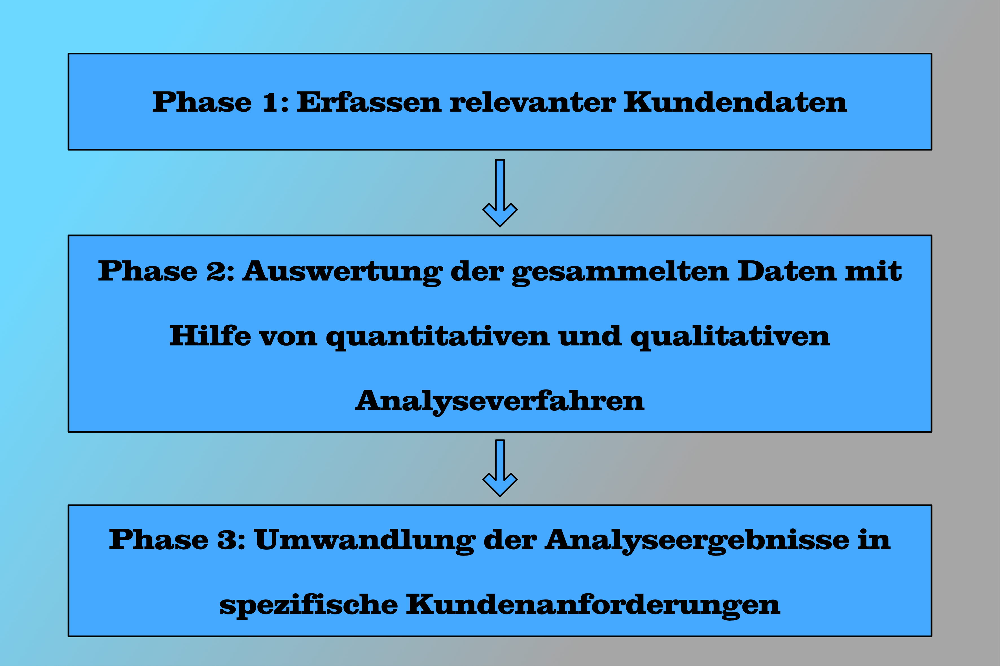

# Überblick
Voice of the Customer (VOC) ist ein Prozess in einem Unternehmen, bestehend aus drei Phasen, der dazu dient die
* Bedürfnisse
* Wünsche
* Erwartungen
* Vorstellungen
* Ängste
* vergangenen Erfahrungen

der Kunden zu verstehen, um diese in verschiedenen Arbeitsprozessen berücksichtigen zu können [^1].

Ziel ist es, nach Analyse der gewonnen Daten über die Kunden, diese in nützliche und quantifizierbare Informationen umzuwandeln, die in den relevanten Arbeitsprozessen des Unternehmens verwendet werden können [^2]. Dies dient in erster Linie dazu, um bestmöglichste Resultate für ihre Kunden produzieren zu können.

Bei VOC handelt es sich viel weniger um einen einzigen Arbeitsschritt, sondern um einen mehrschichtigen Prozess, der zu verschiedenen Zeitpunkten [^3] des Unternehmensprozesses in mehreren Bereichen mit eingebunden ist. In [Six Sigma](https://github.com/ManagingProjectsSuccessfully/ManagingProjectsSuccessfully.github.io/blob/main/kb/Six_Sigma.md) ist Voice of the Customer ein wichtiger Teil der Define-Phase.

# Hintergrund und Relevanz von VOC
Um als Unternehmen erfolgreich bestehen zu bleiben, ist es notwendig die Kundenbedürfnisse, besser bzw. gut differenziert von dem Angebot anderer Unternehmen zu erfüllen. Dies kann ein Unternehmen nur durch die sorgfältige Analyse der Kundenbedürfnisse erreichen.

Aus diesem Grund entstand Mitte der 80er Jahre bis Anfang der 90er Jahre im Zuge der Weiterentwicklung von Quality Function Deployment (QFD) Voice of the Customer [^2]. Seitdem ist die Relevanz von VOC konstant gestiegen, da es auf Grund der Konkurrenz für ein Unternehmen immer wichtiger wurde, die Wünsche und Erwartungen ihrer Kunden besser zu verstehen, um sie mindestens genauso gut, wie ihre Konkurrenten, erfüllen zu können. Dadurch wird VOC vor allem im [Projektmanagement](https://github.com/ManagingProjectsSuccessfully/ManagingProjectsSuccessfully.github.io/blob/main/kb/Projektmanagement.md), egal ob [klassisch](https://github.com/ManagingProjectsSuccessfully/ManagingProjectsSuccessfully.github.io/blob/main/kb/Projektphasen_klassisch.md) oder [agil](https://github.com/ManagingProjectsSuccessfully/ManagingProjectsSuccessfully.github.io/blob/main/kb/Agiles_Manifest.md), zu einem zentralen Aspekt.

# Die 3 fundamentalen Phasen von einem VOC-Prozess
Da es sich um einen vielschichtigen Prozess handelt, der zu verschiedenen Zeitpunkten in verschiedenen Unternehmensbereichen relevant ist und umgesetzt wird, kann sich der VOC-Prozess von Unternehmen zu Unternehmen sehr unterschiedlich gestalten. Zudem haben sich immer mehr Möglichkeiten und Tools entwickelt, die den VOC-Prozess eines Unternehmens unterstützen. Am Ende ist es jedem Unternehmen, sogar jedem individuellen Projekt, selbst überlassen, wie sie ihren VOC-Prozess gestalten wollen.

Trotz sehr unterschiedlicher Gestaltung des VOC-Prozesses verschiedener Unternehmen, lässt sich eine fundamentale Struktur, bestehend aus drei zentralen Phasen, feststellen. Dabei besitzt jede grundlegende Phase mehrere verschiedene Möglichkeiten diese zu gestalten und ihre Funktion umzusetzen. Deshalb scheinen VOC-Prozesse nach außen sehr verschieden. 

*Die 3 fundamentalen Phasen von einem VOC-Prozess*

## Phase 1: Erfassen relevanter Kundendaten [^4]
Zuerst müssen relevante Kundendaten von dem Unternehmen gesammelt werden. Die gesammelten Daten bilden die Grundlage des gesamten VOC-Prozesses. Wichtig ist es die Datenerhebung auf die Bedürfnisse, Wünsche und Erwartungen der Kunden auszurichten. Ziel ist es am Ende wirklich zu verstehen warum Kunden gewisse Dinge besonders wert schätzen [^5]. Um dieses Ziel zu erreichen, muss die Datenerhebung gezielt darauf ausgerichtet werden.

Mittlerweile haben sie zahlreiche Methoden entwickelt, um diese Art relevanter Kundendaten zu sammeln. Hier eine Übersicht über verschiedene Möglichkeiten:
* Kundenbefragungen [^3]
* Social Media Kanäle befolgen [^3]
* Pilotmärkte [^1]
* Rückmeldungen bisheriger Kunden [^1]
* Laboruntersuchungen [^1]
* Feedback Formulare [^6]
* Chat Bot [^6]
* Net Promoter Score [^6]
* Onsite-Kundenumfragen [^7]
* Website-Nutzerverhalten [^7]
* Fokusgruppen [^7]
* E-Mails [^7]

## Phase 2: Auswertung der gesammelten Daten mit Hilfe von quantitativen und qualitativen Analyseverfahren [^4]
Sobald die Daten erhoben wurden, müssen diese durch entsprechende Analyseverfahren ausgewertet werden. Das Analyseverfahren hängt dabei immer von der gewählten Erhebungsmethode ab. 

Bei der Analyse ist es wichtig das volle Potential aus den erhobenen Daten auszuschöpfen. Deswegen sollten (vor allem wenn es sich um Daten verschiedener Kanäle handelt) mehrere verschiedene Analysemethoden angewendet werden und gegebenenfalls kombiniert werden [^3]. Auf Grund von steigender Komplexität werden immer mehr Software-Lösungen dafür eingesetzt [^3].

## Phase 3: Umwandlung der Analyseergebnisse in spezifische Kundenanforderungen [^5] [^2]
Mit den Ergebnissen, die ein Unternehmen aus Phase 2 bekommt, kann man noch nichts Signifikantes bewirken. Um den vollen Nutzen aus den analysierten Daten zu bekommen, müssen diese erst noch in spezifische Kundenanforderungen übersetzt werden [^5] [^2]. Damit sind qualitative und quantitative Zielwerte gemeint, die sinnvoll für eine bestimmte Aufgabe strukturiert wurden [^1]. Mögliche Tools dafür sind Critical To Quality (CTQ) [^1] oder House of Quality [^5].

Das Resultat von Phase 3 sollte eine vollständige Liste mit strukturierten Kundenanforderungen sein, die anschließend an die relevanten Stellen im Unternehmen weitergeleitet werden [^2]. Unabhängig vom Unternehmensbereich sollte es das Ziel sein mit Hilfe von einer einheitlichen Sprache den Leuten im Unternehmen, die Betrachtungsweise der Kundenbedürfnisse [^1] zu vermitteln, damit an jeder Stelle im Arbeitsprozess verstanden wird, worauf es bei der fertigen Leistung wirklich ankommt [^5].

Abschließend steht oder fällt der Erfolg eines VOC-Prozesses, ob die gewonnen Erkenntnisse sinnvoll verteilt werden und ob auf die gesammelten Daten auch wirklich Taten des Unternehmens folgen [^6].

# Anwendung von spezifischen Kundenanforderungen in unterschiedlichen Unternehmensbereichen

Wie eingangs erwähnt handelt es sich beim VOC-Prozess um einen vielschichtigen Prozess, was daran liegt, dass die spezifischen Kundenanforderungen (gewonnen aus Phase 3) in sehr vielen verschiedenen Unternehmensbereichen Anwendung finden. Grundsätzlich gilt: Spezifische Kundenanforderungen werden überall da eingesetzt, wo Leistungen für Kunden festgelegt werden müssen [^2].

Der wichtigste Anwendungsbereich ist die Produktentwicklung. Die spezifischen Kundenanforderungen bilden die Basis von der bestimmte Produktmerkmale abgeleitet werden [^2]. So fließen die Kundenanforderungen direkt in die [Ideenfindung](https://github.com/ManagingProjectsSuccessfully/ManagingProjectsSuccessfully.github.io/blob/main/kb/Product_Backlog.md) mit ein [^3]. Auf diese Weise lässt sich gleichzeitig das „Overengineering“ (Produkte mit zu vielen Features auszustatten) vermeiden, was für weniger verschwendete Ressourcen führt [^4]. Die spezifischen Kundenanforderungen des VOC-Prozesses können ebenfalls für Produktvariation und Produktverbesserungen verwendet werden [^2].

Der VOC-Prozess liefert auch vor allem für die Bereiche Marketing und Vertrieb ein wichtiges Verständnis für die Kunden. So kann das Marketingbudget effizienter eingesetzt werden, da man sich mit geeigneter Sprache und überzeugenden Marketingbotschaften zielgenauer an potentielle Kunden wenden kann [^4] [^3]. Im Vertrieb hilft VOC dem Unternehmen besser zu verstehen, wie sie aus Leads neue Kunden gewinnen können, warum neue Kunden sich für das Unternehmen entschieden hat, bzw. warum bestehende Kunden abgewandert sind und wie sie die Gestaltung ihrer Vertriebswege optimieren können [^4] [^3].

Weitere Anwendungsbereiche für spezifische Kundenanforderungen sind die Unternehmensführung [^7], das [Customer Experience](https://github.com/ManagingProjectsSuccessfully/ManagingProjectsSuccessfully.github.io/blob/main/kb/Customer_Experience.md) Management [^4] und der Kundenservice [^4].

# Quellen
[^1]: [The Voice of the Customer (VOC)](https://trainingsmanufaktur.de/lexikon/voice-of-the-customer-voc/)
[^2]: [Voice of the Customer](https://www.projektmagazin.de/methoden/voice-customer)
[^3]: [Voice of the Customer – die Stimme des Kunden](https://www.qualtrics.com/de/erlebnismanagement/kunden/voice-of-the-customer/)
[^4]: [Voice of the Customer: So geben Sie Kunden eine Stimme](https://blog.hubspot.de/service/voice-of-the-customer)
[^5]: [ASQ Episode 17: Voice of the Customer](https://www.youtube.com/watch?v=9Mm_qt7Qmxg)
[^6]: [Voice oft he Customer: So verstehen Sie Ihre Kunden](https://lucidspark.com/de/blog/voice-of-the-customer)
[^7]: [Voice of the Customer Programme und wie sie Kunden binden können](https://www.zenloop.com/de/ressourcen/retention/voice-of-the-customer-programme)

