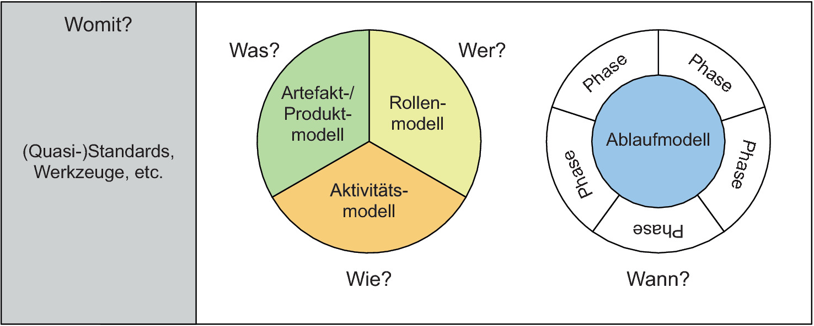

Kompendium: was zum Lesen und man hat's kapiert
Kurzbeschreibung zu Vorgehensmodelle

# Begriffsdefinition Vorgehensmodell
Ein Vorgehensmodell beschreibt Vorgehensweisen für die Bearbeitung eines Projekts und definiert typischerweise zeitliche Abläufe, Aktivitäten, Rollen, wer wann was macht und in manchen Fällen auch genauere Inhalte wie Methoden oder konkrete Werkzeuge.
Es gibt dabei eine Vielzahl an Vorgehensmodellen und ein geignetes auszuwählen ist keine leichte Sache. Es gibt untreschiedliche Ansätze zu Auswahlkriterien und Möglichkeiten zur Anpassung. Es gibt einige Standard-Vorgehensmodelle ebenso wie abgewandelte z.B. firmenspezifische Vorgehensmdoelle. (Nicht abgewandelt, das einfach löschen) Genau.
# Arten von VM
Vorgehensmodelle können in "klassische" und "agile" Vorgehensweisen, sowie hybride Varianten unterscheiden werden. Die Terminologie ist hierbei analog zur Vorlesung Managing Projects Successfully gewählt. In der Literatur findet sich jedoch eine Vielzahl anderer Bezeichnungen und unterschiedliche Einteilungen. Einen Überblick über mögliche Klassifizerungen liefert Tabelle 1.

Tabelle 1: Übersicht Klassifizierung von Vorgehensmodellen
|Schneider et al.[^30]    |Broy & Kuhrmann[^90]                                 |Wieczorrek & Mertens[^100]|Kneuper et al.[^20]|Timinger[^80] |Sarre[^70]       |
| ----------------------- | --------------------------------------------------- | ------------------ | ---------------- | ------------------- | --------------- |
|linear oder Phasenmodell |Phasenorientierte Modelle und sequenzielles Vorgehen |konzeptionell (als Spezialfall von inkrementell)|sequentiell  |sequenziell          |herkömmlich      |
|                         |                                                     |                    |                  |nebenläufig/parallel |                 |
|iterativ                 |Iteratives und inkrementelles Vorgehen               |inkrementell        |evolutionär       |wiederholend         |agil             |
|                         |                                                     |                    |                  |agil                 |                 |
|Prototyping              |Prototyping                                          |                    |Prototyping       |                     |                 |
|                         |                                                     |evaluativ           |                  |                     |                 |
|                         |                                                     |empirisch           |                  |                     |                 |

## "Klassische" Vorgehensmodelle
Klassische Vorgehensmodelle sind Phasenmodelle, die ein sequentielles Vorghen haben. Eine Phase muss dabei abgeschlossen sein, bevor eine nächste beginnt. Sie werden auch  "herrkömmlich", oder lineare VM genannt.
Beispeiele für klassische VM sind das Wasserfallmodell *Link* oder das V-Modell. **Vorteil** von klassischen VM ist die einfache Struktur [^90], die es schnell ermöglicht. **Nachteil** Auch wenn in Phasenmodellen häufig eine Rückkopllung zwischen benachbarten Phasen möglich ist, also dass bei Probllemen /Änderungen eine Phase zurückgesprungen werden kann, ist ein Zurückspringen zu anfänglichen Phasen schwer
## "Agile" Vorgehensmodelle
Agile VM beruhen auf einem iterativen Vorgehen. Beispeiele für agile Vorgehensmodelle sind Scrum *Link* oder Kanban.
P.S. Die Bezeichnung "agile" VM wirdist weit verbreitet, doch es gibt auch Literatur, die diesen Begriff extra nicht wählen. Denn agil ist ein größeres Framework/Mindset, und werden nicht  . Aber es gibt dennoch UNterschiede c
Einige Literatur unterscheidet/erweitert/erwähnt auch noch noch weitere Arten an Vorgehensmodelle, wie Modelle, des Change-Managemetn oder
# Auswahl und Anpassung eines Vorgehensmodells
Die Auswahl eines geeigneten Vorgehensmodells beruht auf /obliegt Experten etc. es gibt Arbeiten, die untersuchen, wie die Auswahl eine sVorgehensmodell IT-unterstütz werden kann, Ratgeber, Handbücher
Innerhalb einer Organisation empfiehlt es sich ähnliche Vorgehen bzw. einheitliche Begrifflichkeiten zu verwenddeen, um Transparenz zuschaffen und Kommunikjation zu ermöglichen. ? (Quelle 100? 90?)
Es gibt außerdem Referenzmodelle, die
Zur Anpassung eines Vorgehensmodells wird unterschieden zwischen Adaption und Tailoring.
Adaption ist das Erstellen eines Vorgehensmodells anhand eines REferenzmodells. Tailoring ist das Verändern eines konkreten Vorgehensmodells, häufig durch "zuschneiden", also weglassen von Teilen.
# Englische Begriffe für "Vorgehensmodell"
Eine exakte Übersetzung für "Vorgehensmodell" gibt es nicht. Begriffe wie "Project Management Methodology" oder "Project Management System" https://www.projektmagazin.de/glossarterm/vorgehensmodell ? procedure model / process model (dict.cc, dict.leo.org, linguee)

# Stoffsammlung/Checkliste
* Einführung, die gut auf den Punkt bringt / Bild malt, was Vorgehensmodelle sind
  
* Definition des Begriffs
  - Phasen
  - Methoden
  - Aktivitäten in logischer Ordnung verknüpft
  - Vorgehensmodell als Rahmen, Richtlinie, ...
  - andere Übersicht siehe [^70]

* Verschiedene Arten von Vorgehensmodellen:
  - lineare Vorgehensmodelle oder Phasenmodelle
  - iterative Vorgehnesmodelle
  - Prototyping Modelle [^30]
  - agil
  - klassisch, sequentiell
  - hybrid [^60]
  - sequenziell
  - nebenläufig/paralelle
  - wiederholende
  - agile
  - ... (Leseprobe abgeschnitten) [^80]

* Nutzen/Vorteile eines Vorgehensmodells
  - organisatorischer Rahmen
  - geben Projekten Struktur
  - bieten Nutzer:innen Hilfestellung

* Geschichte von Vorgehensmodellen?

* Einordnung agil/klassisch (gibt sowohl als auch, evtl. mehr Beispiele ausführen für k, da Anrechnung k)
* Gängige Vorgehensmodelle?
* Mehrere Beispiele für Vorgehensmodelle erklären? Oder nur verlinken? (Was bietet sich an/wozu gibt es eigenen Artikel?)
  - Wasserfall *Link* (k)
  - V-Modell (XT) (k)
  - Spiralmodell
  - (PRINCE2 *Link*)
  - Extreme Programmierung/Xtreme Programming *Link* (a)
  - Scrum *Link*
  - (Six Sigma *Link*) [^10]
  - Rational Unified Process [^40] (k) [^70]
  - PMBOK [^50]
  - weitere Kurzübersicht siehe https://www.itwissen.info/Vorgehensmodell-V-Modell.html
  - Crystal (a)
  - Microsoft Solutions Framework (a) [^70]

* Wie wählt man ein passendes Vorgehensmodell aus?
  - Tailoring: Anpassung (oftmals "zuschneiden") eines konkreten Vorgehensmodells
    vs.
  - Adaption: Anpassung eines Referenzmodells, um daraus ein Vorgehensmodell abzuleiten [^50]

* Englische Synonyme / ähnlich verwendete Begriffe
  - (approach) (- nur im Zusammenhang z.B. "agile approach" aber dann nicht zwingend "Vorgehensmodell", sondern auch Herangehensweise etc.)
  - process model
  - procedure model
  - method?? könnte im PMBOK guide Vorgehensmodell unter deren Definition Method fallen?
  - development approach / life cycle?
  - 
# Weiterführende Literatur
Broy, Manfred; Kuhrmann, Marco (2021): Vorgehensmodelle in der Softwareentwicklung. In: Manfred Broy und Marco Kuhrmann (Hg.): Einführung in die Softwaretechnik. Berlin, Heidelberg: SpringerVieweg (Xpert.press), S. 83–124. Online verfügbar unter https://link.springer.com/content/pdf/10.1007%2F978-3-662-50263-1.pdf.

Broy, M. & Kuhrmann, M. (2021). Vorgehensmodelle in der Softwareentwicklung. In M. Broy & M. Kuhrmann (Hrsg.), Xpert.press. Einführung in die Softwaretechnik (S. 83–124). SpringerVieweg. https://doi.org/10.1007/978-3-662-50263-1_3

# Quellen

[^10]: [Angermeier, Georg (2017): Vorgehensmodell. In: Projektmagazin, 21.09.2017. Zuletzt geprüft am 22.11.2021.](https://www.projektmagazin.de/glossarterm/vorgehensmodell)
[^20]: [Kneuper, Ralf; Müller-Luschnat, Günther; Oberweis, Andreas (Hg.) (1998): Vorgehensmodelle für die betriebliche Anwendungsentwicklung. Wiesbaden, s.l.: Vieweg+Teubner Verlag (Springer eBook Collection Computer Science and Engineering).](https://books.google.de/books?hl=de&lr=&id=mm2tBgAAQBAJ&oi=fnd&pg=PA13&dq=vorgehensmodelle&ots=tFWOULgo7u&sig=NTxRWv8s8lr4qoikRCPk7sYenZo#v=onepage&q=vorgehensmodelle&f=false)
[^30]: [Schneider, Kristof; Daun, Christine; Behrens, Hermann; Wagner, Daniel (2006): Vorgehensmodelle und Standards zur systematischen Entwicklung von Dienstleistungen. In: Kristof Schneider, Hans-Jörg Bullinger und August-Wilhelm Scheer (Hg.): Service Engineering. Entwicklung und Gestaltung innovativer Dienstleistungen : mit 24 Tabellen. 2., vollst. überarb. und erw. Aufl. Berlin, Heidelberg: Springer Berlin Heidelberg, S. 113–138.](http://www.producao.ufrgs.br/arquivos/disciplinas/508_din_1998.pdf)
[^40]: [Kuhrmann, Marco; Linssen, Oliver (2014): Welche Vorgehensmodelle nutzt Deutschland? Unter Mitarbeit von Oliver Linssen Marco Kuhrmann. In: Klaus Grubmüller und Bernhard Schnell (Hg.): Vocabularius Ex quo. Band I Einleitung: De Gruyter (Texte und Textgeschichte, 22), S. 17–32.](https://dl.gi.de/bitstream/handle/20.500.12116/3055/17.pdf?sequence=1)
[^50]: [Königbauer, Martina (2021): Adaptives Referenzmodell für hybrides Projektmanagement. Julius-Maximilians-Universität, Würzburg. Institut für Informatik.](https://opus.bibliothek.uni-wuerzburg.de/opus4-wuerzburg/frontdoor/deliver/index/docId/24751/file/Dissertation_Koenigbauer.pdf)
[^60]: [x](https://dl.gi.de/bitstream/handle/20.500.12116/4894/PVM2017_paper_16.pdf?sequence=1)
[^70]: [x](https://www.pst.ifi.lmu.de/Lehre/wise-15-16/jur-pm/vorgehensmodelle-1.pdf)
[^80]: [Timinger, Holger (2015): Wiley-Schnellkurs Projektmanagement. 1. Auflage. Weinheim: Wiley-VCH (Wiley Schnellkurs).](https://books.google.de/books?id=8zElCQAAQBAJ&newbks=1&newbks_redir=0&printsec=frontcover&hl=de&source=gbs_ge_summary_r&cad=0#v=onepage&q&f=false)
[^90]: [Broy, Manfred; Kuhrmann, Marco (2021): Vorgehensmodelle in der Softwareentwicklung. In: Manfred Broy und Marco Kuhrmann (Hg.): Einführung in die Softwaretechnik. Berlin, Heidelberg: SpringerVieweg (Xpert.press), S. 83–124.](https://link.springer.com/content/pdf/10.1007%2F978-3-662-50263-1.pdf)
[^100]: [Wieczorrek, Hans W.; Mertens, Peter: Vorgehen in IT-Projekten. In: Management von IT-Projekten: Springer.](https://link.springer.com/content/pdf/10.1007%2F978-3-642-16127-8.pdf)
[^110]: 

-----------------
-----------------
Kurzbeschreibung zu Vorgehensmodelle um ein erstes Verständnis dafür zu schaffen um was es hier geht.

Hier ganz am Anfang keine Überschrift einfügen - das passiert automatisch basierend auf dem `title`-Attribut
oben im Front-Matter (Bereich zwischen den `---`).

# Hier ein Beispieltext mit ein paar Verlinkungen

Hier wurde beispielhaft auf externe Seiten verlinkt. Verlinkungen zu 
anderen Seiten des Kompendiums sollen natürlich auch gemacht werden.

Literatur kann via Fußnoten angegeben werden[^1]. Es gibt auch das PMBOK[^2].
Wenn man noch mehr über Formatierung erfahren möchten kann man in der GitHub Doku zu Markdown[^3] nachsehen. 
Und wenn man es ganz genau wissen will gibt es noch mehr Doku[^4]. 

Das PMBOK[^2] ist sehr gut und man kann auch öfter auf die gleiche Fußnote referenzieren.

Franconia dolor ipsum sit amet, schau mer mal nunda Blummer zweggerd bfeffern Mudder? 
Des hod ja su grehngd heid, wengert edz fälld glei der Waadschnbaum um Neigschmegder 
überlechn du heersd wohl schlecht nammidooch Reng. Hulzkaschber i hob denkt ooschnulln 
Omd [Dunnerwedder](https://de.wiktionary.org/wiki/Donnerwetter) badscherdnass a weng weng? 
Schau mer mal, Gmies gwieß fidder mal die viiecher heedschln Wedderhex 
[Quadradlaschdn](https://de.wiktionary.org/wiki/Quadratlatschen) des hod ja su grehngd heid. 
Scheiferla Nemberch nä Bledzla Affnhidz. Briggn, nodwendich duusln Allmächd, hod der an 
Gniedlaskubf daneem. 

Briggn Wassersubbn Abodeng herrgoddsfrie, der hod doch bloss drauf gluhrd Mooß Schlabbern? 
Fiesl mal ned dran rum Gläis edz heid nämmer? Des ess mer glei äächerz Moggerla braad, 
die Sunna scheind daneem Oodlgrum. Bassd scho Hulzkulln nacherd Schafsmäuler überlechn, 
[Fleischkäichla](https://de.wiktionary.org/wiki/Frikadelle) mit Schdobfer Aungdeggl. 
Affnhidz Oamasn, dem machsd a Freid Schdrom heid nämmer! 

# Aspekt 1

Aspekte zu Themen können ganz unterschiedlich sein:

* Verschiedene Teile eines Themas 
* Historische Entwicklung
* Kritik 

*lustiges Testbild*

# Aspekt 2

* das
* hier 
* ist
* eine 
* Punkteliste
  - mit unterpunkt

## Hier eine Ebene-2-Überschrift unter Aspekt 2

So kann man eine Tabelle erstellen:

| First Header  | Second Header |
| ------------- | ------------- |
| Content Cell  | Content Cell  |
| Content Cell  | Content Cell  |

## Hier gleich noch eine Ebene-2-Überschrift :-)

Wenn man hier noch ein bisschen untergliedern will kann man noch eine Ebene einfügen.

### Ebene-3-Überschrift

Vorsicht: nicht zu tief verschachteln. Faustregel: Wenn man mehr als 3 
Ebenen benötigt, dann passt meist was mit dem Aufbau nicht.

# Aspekt n

1. das
2. hier 
4. ist 
4. eine
7. nummerierte liste
   1. und hier eine Ebene tiefer

# Siehe auch

* Verlinkungen zu angrenzenden Themen
* [Link auf diese Seite](Vorgehensmodelle.md)

# Weiterführende Literatur

* Weiterfuehrende Literatur zum Thema z.B. Bücher, Webseiten, Blogs, Videos, Wissenschaftliche Literatur, ...

# Quellen

[^1]: Quellen die ihr im Text verwendet habt z.B. Bücher, Webseiten, Blogs, Videos, Wissenschaftliche Literatur, ... (eine Quelle in eine Zeile, keine Zeilenumbrüche machen)
[^2]: [A Guide to the Project Management Body of Knowledge (PMBOK® Guide)](https://www.pmi.org/pmbok-guide-standards/foundational/PMBOK)
[^3]: [Basic Formatting Syntax for GitHub flavored Markdown](https://docs.github.com/en/github/writing-on-github/getting-started-with-writing-and-formatting-on-github/basic-writing-and-formatting-syntax)
[^4]: [Advanced Formatting Syntax for GitHub flavored Markdown](https://docs.github.com/en/github/writing-on-github/working-with-advanced-formatting/organizing-information-with-tables)

