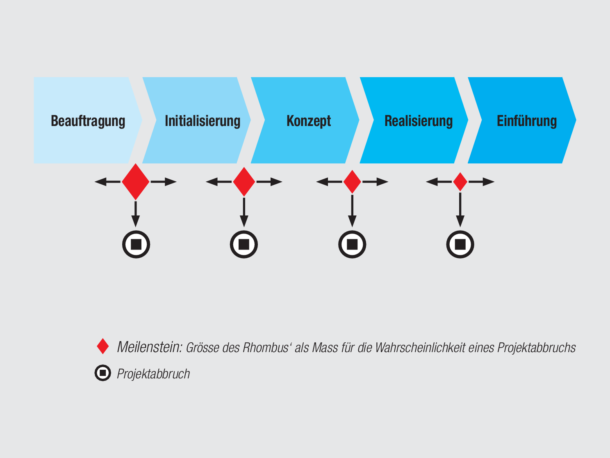
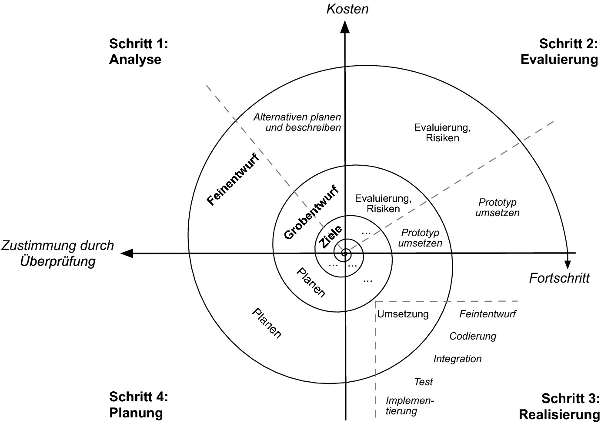

Ein Vorgehensmodell beschreibt Vorgehensweisen für die Bearbeitung eines Projekts und definiert typischerweise [zeitliche Abläufe](Zeitplanung.md), Aktivitäten, [Rollen](Verantwortlichkeiten.md) - kurz *wer was wann* macht - und in manchen Fällen auch genauere Inhalte wie Methoden oder konkrete Werkzeuge. Vorgehensmodelle bieten einen organisatorischen Rahmen und dienen Nutzer:innen als Hilfestellung.[^110][^90]
Es gibt dabei eine Vielzahl an Vorgehensmodellen und ein geeignetes auszuwählen ist keine leichte Aufgabe. Es existieren unterschiedliche Ansätze zu Auswahlkriterien und Möglichkeiten zur Anpassung.[^50]

# Begriffsdefinition Vorgehensmodell
Broy und Kuhrmann[^110] definieren den Begriff Vorgehensmodell folgendermaßen:  
>"Ein Vorgehensmodell beschreibt systematische, ingenieurmäßige und quantifizierbare Vorgehensweisen, um Aufgaben einer bestimmten
Klasse wiederholbar zu lösen."[^110]

Vorgehensmodelle sind dabei von [Methoden](Methoden.md) zu unterscheiden. In einem Vorgehensmodell können verschiedene Methoden angewandt werden,[^110] die durch das Vorgehensmodell vorgegeben sein können.[^30] Abbildung 1 zeichnet einen Überblick über Bestandteile eines Vorgehensmodells.

Abbildung 1: Bestandteile eines Vorgehensmodells[^90]

# Arten von Vorgehensmodellen
Vorgehensmodelle können in klassische und [agile](Agiles_Manifest.md) Vorgehensweisen, sowie [hybride](Hybrides_Projektmanagment.md) Varianten unterscheiden werden. Die Terminologie ist hierbei analog zur Vorlesung Managing Projects Successfully gewählt. In der Literatur findet sich jedoch eine Vielzahl an Bezeichnungen und unterschiedliche Einteilungen. Einen Überblick über mögliche Klassifizerungen liefert Tabelle 1.

Tabelle 1: Übersicht Klassifizierung von Vorgehensmodellen
|Schneider et al.[^30]    |Broy & Kuhrmann[^90]                                 |Wieczorrek & Mertens[^100]|Kneuper et al.[^20]|Timinger[^80] |Kuster et al.[^120]|
| ----------------------- | --------------------------------------------------- | ------------------ | ---------------- | ------------------- | --------------- |
|linear oder Phasenmodell |phasenorientierte Modelle und sequenzielles Vorgehen |konzeptionell (als Spezialfall von inkrementell)|sequentiell  |sequenziell          |klassisch / Phasenkonzept|
|                         |                                                     |                    |                  |nebenläufig/parallel |                   |
|iterativ                 |iteratives und inkrementelles Vorgehen               |inkrementell        |evolutionär       |wiederholend         |agil               |
|                         |                                                     |                    |                  |agil                 |                   |
|Prototyping              |Prototyping                                          |                    |Prototyping       |                     |                   |
|                         |                                                     |evaluativ           |                  |                     |                   |
|                         |                                                     |empirisch           |                  |                     |                   |

## Klassische Vorgehensmodelle
Klassische Vorgehensmodelle, auch lineare Vorgehens- oder Phasenmodelle[^30] genannt, bestehen aus nacheinander abfolgenden [Phasen](Projektphasen_klassisch.md). Ein solches Vorgehen wird als sequentiell[^20][^80] bezeichnet. "Jede dieser Phasen bündelt dabei eine Reihe von Aktivitäten, welche vollständig und in der richtigen Reihenfolge durchzuführen sind."[^90] Zum Abschluss einer Phase wird meist ein [Meilenstein](Meilensteine.md) erzeugt.
Der wohl geläufigste Vertreter klassischer Vorgehensmodelle ist das [Wasserfallmodell](Wasserfall_Modell.md). Weitere bekannte Beispiele sind das [V-Modell XT](VModell)[^80] und Rational Unified Process[^40].

Abbildung 2: Schema eines Phasenkonzepts[^120]
  
  
**Vorteil** von klassischen Vorgehensmodellen ist die einfache Struktur mit klarer Einteilung, welche eine hohe Prozesstransparenz gewährleistet.[^30]

**Nachteil** ist das hohe Risiko durch mangelnde Flexibilität. Auch wenn in Phasenmodellen häufig eine Rückkopplung zwischen benachbarten Phasen möglich ist, ist ein Zurückspringen in weiter zurückliegende Phasen nicht vorgesehen. Diese sequentielle Struktur wird problematisch, wenn sich Bedingungen verändern.[^90][^30]

Klassische Vorgehensmodelle eignen sich daher besonders für risikoarme Projekte, bei denen von Anfang an Anforderung und Lösung verhältnismäßig klar sind, und mit geringen Änderungen im Projektverlauf zu rechnen ist.[^90] Beispiele könnten Ausschreibungs- und Vergabeverfahren des öffentlichen Sektors sein.[^100]

## Agile Vorgehensmodelle
Agile Vorgehensmodelle beruhen auf iterativem und inkrementellem Vorgehen. Iteratives Vorgehen bedeutet, dass eine Reihe von Aktivitäten bei jedem Durchlauf wiederholt wird. Bei einer inkrementellen Vorgehensweise wird zunächst ein Teilsystem entwickelt und dieses dann schrittweise weiter ausgebaut.[^90][^100][^110]
Weitverbreitete agile Vorgehensmodelle sind beispielsweise das Spiralmodell, [Extreme Programmierung](Xtreme_Programming.md), [Scrum](SCRUM.md) oder [Kanban](Kanban.md).

Abbildung 3: Konzept des Spiralmodells[^90]

**Vorteil** agiler Vorgehensmodelle ist, dass durch das inkrementelle Vorgehen früh erste einsetzbare Ergebnisse vorliegen[^10] und durch die Iterationen auf Fehler und Änderungen leichter eingegangen werden kann als bei Phasenmodellen.

**Nachteil** ist, dass das Projekt dazu geeignet sein muss Teilaspekte nacheinander zu entwickeln und jeweils an das vorige Ergebnis anzufügen.[^110]

Agile Vorgehensmodelle können auch eingesetzt werden, wenn die genaueren Anforderungen zu Beginn noch nicht feststehen.[^120] Sie eignen sich daher besonders für komplexe Aufgabenstellungen in Umgebungen mit stetigen Veränderungen,[^120] sofern das Projektergebnis sich sinnvoll in Teilabschnitte auftrennen lässt.[^100][^90]

## Weitere Vorgehensmodelle
Es ist möglich klassische und agile Herangehensweise zu kombinieren, beispielsweise indem ausgewählte Projektphasen oder Teilprojekte eines klassischen Vorgehensmodells agil durchgeführt werden. Solche Kombinationen werden auch als [hybride](Hybrides_Projektmanagment.md) Vorgehensmodelle bezeichnet.[^120]
Als eigene Art von Vorgehensmodellen wird zudem häufig Prototyping aufgeführt. Es ähnelt dem agilen Vorgehen, da das Endergebnis ebenfalls durch schrittweises Ausbauen eines hier Prototyps entsteht. Der Prototyp besitzt zu einem frühen Zeitpunkt ausgewählte oder kritische Funktionen, um ein Testen in realisitischer Umgebung zu ermöglichen.[^110]

# Weiterführende Literatur
Broy, Manfred; Kuhrmann, Marco (2021): Vorgehensmodelle in der Softwareentwicklung. In: Manfred Broy und Marco Kuhrmann (Hg.): Einführung in die Softwaretechnik. Berlin, Heidelberg: SpringerVieweg (Xpert.press), S. 83–124. Online verfügbar unter https://link.springer.com/content/pdf/10.1007%2F978-3-662-50263-1.pdf.

# Quellen
[^10]: [Angermeier, Georg (2017): Vorgehensmodell. In: Projektmagazin, 21.09.2017. Zuletzt geprüft am 22.11.2021.](https://www.projektmagazin.de/glossarterm/vorgehensmodell)
[^20]: [Kneuper, Ralf; Müller-Luschnat, Günther; Oberweis, Andreas (Hg.) (1998): Vorgehensmodelle für die betriebliche Anwendungsentwicklung. Wiesbaden, s.l.: Vieweg+Teubner Verlag (Springer eBook Collection Computer Science and Engineering).](https://books.google.de/books?hl=de&lr=&id=mm2tBgAAQBAJ&oi=fnd&pg=PA13&dq=vorgehensmodelle&ots=tFWOULgo7u&sig=NTxRWv8s8lr4qoikRCPk7sYenZo#v=onepage&q=vorgehensmodelle&f=false)
[^30]: [Schneider, Kristof; Daun, Christine; Behrens, Hermann; Wagner, Daniel (2006): Vorgehensmodelle und Standards zur systematischen Entwicklung von Dienstleistungen. In: Kristof Schneider, Hans-Jörg Bullinger und August-Wilhelm Scheer (Hg.): Service Engineering. Entwicklung und Gestaltung innovativer Dienstleistungen : mit 24 Tabellen. 2., vollst. überarb. und erw. Aufl. Berlin, Heidelberg: Springer Berlin Heidelberg, S. 113–138.](http://www.producao.ufrgs.br/arquivos/disciplinas/508_din_1998.pdf)
[^40]: [Kuhrmann, Marco; Linssen, Oliver (2014): Welche Vorgehensmodelle nutzt Deutschland? Unter Mitarbeit von Oliver Linssen Marco Kuhrmann. In: Klaus Grubmüller und Bernhard Schnell (Hg.): Vocabularius Ex quo. Band I Einleitung: De Gruyter (Texte und Textgeschichte, 22), S. 17–32.](https://dl.gi.de/bitstream/handle/20.500.12116/3055/17.pdf?sequence=1)
[^50]: [Königbauer, Martina (2021): Adaptives Referenzmodell für hybrides Projektmanagement. Julius-Maximilians-Universität, Würzburg. Institut für Informatik.](https://opus.bibliothek.uni-wuerzburg.de/opus4-wuerzburg/frontdoor/deliver/index/docId/24751/file/Dissertation_Koenigbauer.pdf)
[^60]: [x](https://dl.gi.de/bitstream/handle/20.500.12116/4894/PVM2017_paper_16.pdf?sequence=1)
[^70]: [x](https://www.pst.ifi.lmu.de/Lehre/wise-15-16/jur-pm/vorgehensmodelle-1.pdf)
[^80]: [Timinger, Holger (2015): Wiley-Schnellkurs Projektmanagement. 1. Auflage. Weinheim: Wiley-VCH (Wiley Schnellkurs).](https://books.google.de/books?id=8zElCQAAQBAJ&newbks=1&newbks_redir=0&printsec=frontcover&hl=de&source=gbs_ge_summary_r&cad=0#v=onepage&q&f=false)
[^90]: [Broy, Manfred; Kuhrmann, Marco (2021): Vorgehensmodelle in der Softwareentwicklung. In: Manfred Broy und Marco Kuhrmann (Hg.): Einführung in die Softwaretechnik. Berlin, Heidelberg: SpringerVieweg (Xpert.press), S. 83–124.](https://link.springer.com/content/pdf/10.1007%2F978-3-662-50263-1.pdf)
[^100]: [Wieczorrek, Hans W.; Mertens, Peter: Vorgehen in IT-Projekten. In: Management von IT-Projekten: Springer.](https://link.springer.com/content/pdf/10.1007%2F978-3-642-16127-8.pdf)
[^110]: [Broy, Manfred (2013): Projektorganisation und Management Im Software Engineering. Unter Mitarbeit von Marco Kuhrmann. 1st ed. Berlin, Heidelberg: Springer Berlin / Heidelberg (Xpert. press Ser).](https://link.springer.com/content/pdf/10.1007%2F978-3-642-29290-3.pdf)
[^120]: [Kuster, Jürg; Bachmann, Christian; Huber, Eugen; Hubmann, Mike; Lippmann, Robert; Schneider, Emil et al. (2011): Handbuch Projektmanagement. 4. Aufl.: Springer Gabler.](https://link.springer.com/content/pdf/10.1007/978-3-662-57878-0.pdf)
