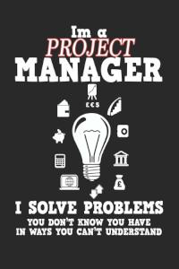

Wasserfall-Modell ist nicht anders als ein lineares sequenzielles Vorgehensmodell, damit ist gemeint, dass die Phasen nicht parallel zueinander ablaufen können, aber was ist genau ein Wasserfall-Modell: Stellen wir uns ein Softwareprojekt vor, da haben wir der Beginn und das Resultat, dazwischen liegt die Softwareentwicklung, dabei ist der Wasserfall-Modell einer der Vorgehensweise einer Softwareentwicklung. Royce hat es im Jahr 1970 vorgeschlagen und wurde dann von Boehm als „Wasserfall-Modell“ bezeichnet. Außerdem besteht es aus fünf bis sieben Phasen.

# Grundkonzepte und Phasen: 

Die Hauptgrundidee ist die Aufteilung des Projekts in Phasen, hier springt man von einer Phase auf die Nächste, sobald man die Phase erfolgreich abgeschlossen hat. Zurückspringen ist dementsprechend auch möglich, wenn es ein Fehler in einer abgeschlossenen Phase aufgetreten ist, ist einem möglich wieder auf die letzte Phase zurückzugreifen, das nennen wir: Feedback-Looping[^1]
Trotz der Feedback-Looping ist Wasserfall-Modell kein Agiles-Modell, da lineare und starre Abfolge das Ganze ist.

Wir befinden uns zuerst bei der
1.  Analyse:
Ein Auftrag wird von der Kunde erteilt, in dem der Kunde seine Erwartungen mitteilt, da plant man alles bezüglich Kosten und Termine, sowie ein Entwicklerteam wird dann zusammengestellt.
2. Design/ Entwurf:
und da wird das ganze Softwaredesign gemacht und als Resultat dieser Phase wird der Bauplan der Software erstellt dann
3. Implementierung:
Da wird die Softwarearchitektur, die in der Design-Phase erarbeitet wurde, in der Implementierungsphase realisiert. Zumeist kristallisieren sich in der Implementierungsphase jedoch Fehler oder nicht realisierbare Teilaufgaben heraus, die in der Entwurfsphase entstanden sind. Daher erfolgen im Regelfall häufig Rückkopplungen zwischen Entwurfs- und Implementierungsphase.
4. Testing Phase:
hier wird die fertigte Produkt/Software geprüft und außerdem wird in dieser Phase die Integration auf verschieden Betriebssysteme vorgesehen. 
5. Einführung und Wartung: 
das Endprodukt wird an der Kunde geliefert und der erhält noch die Einweisung dazu. Das Projektteam wird der Kunde für zukünftige Wartungs- und Anpassungsarbeiten verantwortlich.

# Eigenschaften der Wasserfall-Modell:
Man ordnet die Aktivitäten in einer Reihenfolge und dazu führt man es in der vollständigen Breite komplett, außerdem es ist leicht zu verstehen und easy machbar. Darüber hinaus es ist ein sequenzielles Vorgehensmodell, damit ist gemeint, dass jede Phase erst anfängt, wenn die letzte erfolgreich abgeschlossen ist  

# Vorteile der Wasserfall-Modell:

* zum einen hat man hier die klaren voneinander abgegrenzten Phasen und dadurch kann man für jede abgegrenzte Phase bestimmte Ziele zuordnen
* Klare Abschätzung der Kosten jeder Phase sowie der Dauer davon
* Gut Ausreichende Dokumentation von dem Entwicklungsprozesse, in dem man klar definierte Meilensteine darstellt
* Zeitachse kann leicht abgebildet werden  

*lustiges Testbild*

# Aspekt 2

* das
* hier 
* ist
* eine 
* Punkteliste
  - mit unterpunkt

## Hier eine Ebene-2-Überschrift unter Aspekt 2

So kann man eine Tabelle erstellen:

| First Header  | Second Header |
| ------------- | ------------- |
| Content Cell  | Content Cell  |
| Content Cell  | Content Cell  |

## Hier gleich noch eine Ebene-2-Überschrift :-)

Wenn man hier noch ein bisschen untergliedern will kann man noch eine Ebene einfügen.

### Ebene-3-Überschrift

Vorsicht: nicht zu tief verschachteln. Faustregel: Wenn man mehr als 3 
Ebenen benötigt, dann passt meist was mit dem Aufbau nicht.

# Aspekt n

1. das
2. hier 
4. ist 
4. eine
7. nummerierte liste
   1. und hier eine Ebene tiefer

# Siehe auch

* Verlinkungen zu angrenzenden Themen
* [Link auf diese Seite](Wasserfall_Modell.md)

# Weiterführende Literatur

* Weiterfuehrende Literatur zum Thema z.B. Bücher, Webseiten, Blogs, Videos, Wissenschaftliche Literatur, ...

# Quellen

[^1]: Quellen die ihr im Text verwendet habt z.B. Bücher, Webseiten, Blogs, Videos, Wissenschaftliche Literatur, ... (eine Quelle in eine Zeile, keine Zeilenumbrüche machen)
[^2]: [A Guide to the Project Management Body of Knowledge (PMBOK® Guide)](https://www.pmi.org/pmbok-guide-standards/foundational/PMBOK)
[^3]: [Basic Formatting Syntax for GitHub flavored Markdown](https://docs.github.com/en/github/writing-on-github/getting-started-with-writing-and-formatting-on-github/basic-writing-and-formatting-syntax)
[^4]: [Advanced Formatting Syntax for GitHub flavored Markdown](https://docs.github.com/en/github/writing-on-github/working-with-advanced-formatting/organizing-information-with-tables)

