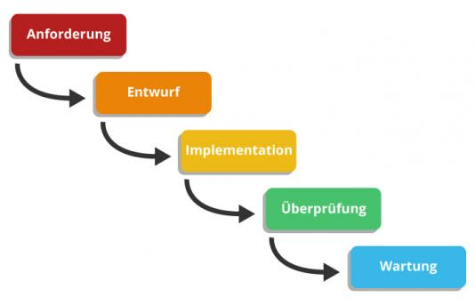

Das [Wasserfallmodell](Wasserfallmodell.md) ist ein [lineares_Modell](lineares_Modell.md), das das Projekt Schritt für Schritt nach einem klar definierten Prozess abarbeitet. Der Prozess gliedert sich in aufeinanderfolgende Phasen, deren Ergebnis zu einem definitiven Endergebnis führen soll.[^1] Dieses Modell wird hauptsächlich für die Softwareentwicklung verwendet. Das Modell wurde von Royce im Jahr 1970 entwickelt und enthlält fünf bis zu Sieben Phasen.[^2]

# Grundkonzepte und Phasen: 

Jede dieser Phasen endet mit einem Meilenstein, für den eine definierte Ergebnismenge bereitgestellt werden muss. Jede Phase ist mit verschiedenen Aktivitäten gebündelt, die vollständig in der richtigen Reihenfolge ausgeführt werden müssen. Am Ende jeder Aktivität steht ein fertiges Ergebnis.[^3]Tritt in einer abgeschlossenen Stufe ein Fehler auf, kann zur letzten Stufe zurückgekehrt werden, dieser Vorgang wird als [Feedback-Looping](Feedback-Looping.md)[^4]

* Die 5 Phasen des Wasserfallmodells [^5]

##  1. Anforderung:
Ein Auftrag wird von der Kunde erteilt, in dem der Kunde seine Erwartungen mitteilt, da plant man alles bezüglich Kosten und Termine, sowie ein Entwicklerteam wird dann zusammengestellt.

##  2. Design/ Entwurf:
und da wird das ganze Softwaredesign gemacht und als Resultat dieser Phase wird der Bauplan der Software erstellt.

##  3. Implementierung:
Da wird die Softwarearchitektur, die in der Design-Phase erarbeitet wurde, in der Implementierungsphase realisiert. Zumeist kristallisieren sich in der Implementierungsphase jedoch Fehler oder nicht realisierbare Teilaufgaben heraus, die in der Entwurfsphase entstanden sind. Daher erfolgen im Regelfall häufig Rückkopplungen zwischen Entwurfs- und Implementierungsphase.
##  4. Überprüfung:
hier wird die fertigte Produkt/Software geprüft und außerdem wird in dieser Phase die Integration auf verschieden Betriebssysteme vorgesehen. 
##  5. Einführung und Wartung: 
das Endprodukt wird an der Kunde geliefert und der erhält noch die Einweisung dazu. Das Projektteam wird der Kunde für zukünftige Wartungs- und Anpassungsarbeiten verantwortlich.

# Eigenschaften der Wasserfall-Modell:
Man ordnet die Aktivitäten in einer Reihenfolge und dazu führt man es in der vollständigen Breite komplett, außerdem es ist leicht zu verstehen und easy machbar. Darüber hinaus es ist ein sequenzielles Vorgehensmodell, damit ist gemeint, dass jede Phase erst anfängt, wenn die letzte erfolgreich abgeschlossen ist.[^3]

# Vorteile der Wasserfall-Modell:

* Zum einen hat man hier die klaren voneinander abgegrenzten Phasen und dadurch kann man für jede abgegrenzte Phase bestimmte Ziele zuordnen
* Klare Abschätzung der Kosten jeder Phase sowie der Dauer davon
* Gut ausreichende Dokumentation von dem Entwicklungsprozess, in dem man klar definierte Meilensteine darstellt
* Zeitachse kann leicht abgebildet werden  

# Nachteile der Wasserfall-Modell:
Das Modell bringt auch paar kritische Punkte mit wie:
* Klare Abgrenzung der Phasen ist eher unmöglich, zum Beispiel: wenn man in der Testphase feststellt, dass es Fehler in dem Design gibt, dann wird nicht richtig abgegrenzt
* Kaum ein Spielraum vorhanden, damit man den Phasenablauf anpassen kann, wegen veränderten Anforderungen
* Man kann den Fehlern erst am Ende der Entwicklungsprozess erkennen.
* Kaum flexibel gegenüber Änderungen, da starre Reihenfolge 
* Es ist schwierig für einen die Entwicklungsphasen nacheinander reibungslos zu bearbeiten
* Fehlerkorrektur ist teuer und sehr aufwendig.

# Andere Vorgehensmodelle:
  Wegen der einige gravierende Nachteile, die die wirtschaftliche Lage beschädigen, wird viele alternative von der IT-Industrie angeboten, wie z.b.:
*	Spiralmodell
*	Rational Unified Process
*	V-Modell

# Siehe auch:

* Der Unterschied zwischen klassisches Wasserfall_Modell und das agile Modell:
  https://www.wegewerk.com/de/blog/wasserfall-vs-agile-umsetzung/

# Quellen:

[^1]: https://www.teamazing.de/was-ist-das-wasserfallmodell/
[^2]: https://www.enzyklopaedie-der-wirtschaftsinformatik.de/lexikon/is-management/Systementwicklung/Vorgehensmodell/Wasserfallmodell/index.html
[^3]: https://www.enzyklopaedie-der-wirtschaftsinformatik.de/lexikon/is-management/Systementwicklung/Vorgehensmodell/Wasserfallmodell/index.html
[^4]: https://www.quality.de/lexikon/wasserfallmodell/ 
[^5]: https://www.netzsieger.de/ratgeber/methoden-des-traditionellen-projektmanagements#pid=1
* https://www.teamazing.de/was-ist-das-wasserfallmodell/
* https://management.bildungsbibel.de/projektmanagement-wasserfallmodell-softwareentwicklung-phasen
* https://www.ionos.de/digitalguide/websites/web-entwicklung/wasserfallmodell/

