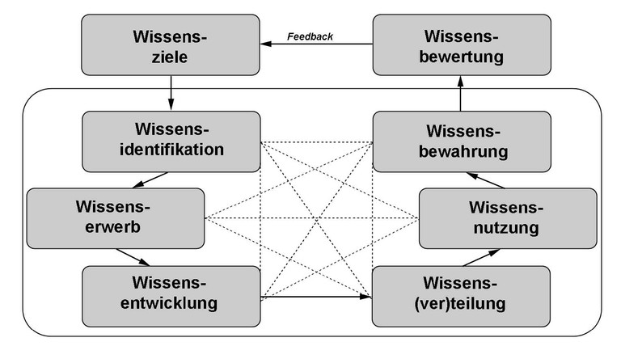

Wissensmanagement ist „die systematische Gestaltung von Rahmenbedingungen und Prozessen um Wissen als Fähigkeit zum effektiven Handeln in der richtigen Qualität, d.h. Tiefe, Verteilung, Vernetzung und Kodifizierung, für eine Organisation oder eine Einzelperson und deren Ziele bereit zu stellen“[^1]. 

# Aufgaben des Wissensmanagements 
Die Aufgabe des Wissensmanagements liegt darin, einen reibungslosen Informationsfluss zwischen Projektbeteiligten, Technologie und Projektorganisation zu schaffen und gleichzeitig einen langfristigen Zugang zu diesen gewonnenen Informationen zu ermöglichen[^2]. 

Dabei werden folgende Funktionen erfüllt: 

* Kompetenz der Mitarbeiter transparent machen
*	Projektergebnisse dokumentieren
*	Wissensaustausch unterstützen
*	Raum für informellen Austausch schaffen
*	Wissen erwerben
*	Wissen entwickeln
*	Wissen speichern
*	Wissen nutzen

Dabei spielt vor allem der Transfer von Wissen eine entscheidende Rolle. Das Ziel hierbei ist, implizites Wissen in explizites Wissen um zu wandeln und so eine Art kollektives Wissen zu schaffen[^3].  (siehe [Wissenstransfer](Wissenstransfer.md))

# Unterscheidung implizites und explizites Wissen

## Implizites Wissen

Implizites Wissen wird oftmals auch als stilles Wissen bezeichnet, denn es steht in direktem Bezug zu dem individuellen Können einer Person, ohne dass dieser ihr Wissen bewusst ist. Dieses Wissen basiert auf Erinnerungen, Überzeugungen und Erfahrungen und ist daher schwer in sprachlicher Form auf andere Personen übertragbar. Dies wird erst möglich, wenn implizites Wissen in explizites Wissen transformiert wird[^4].

## Explizites Wissen

Explizites Wissen bezeichnet ein formulierbares Wissen und ist deshalb leicht reproduzierbar. Es kann ohne Probleme beschrieben und nachvollzogen werden, da es sich durch eine systematische, formale Sprache, wie beispielsweise durch Wörter und Zahlen vermitteln lässt. In diesem Zusammenhang wird es oft auch als methodisches oder spezifisches Wissen bezeichnet[^5]. 

# Modelle des Wissensmanagements

## Bausteinmodell nach Probst/Raub/Romhardt:

Das Bausteinmodell stellt ein weit verbreitetes Modell des Wissensmanagements dar. Dieses Modell bildet einen traditionellen Managementprozess ab und besteht aus 8 Bausteinen, welche sich in einen äußeren Kreislauf (strategische Steuerungsaufgaben) und einen inneren Kreislauf (Umsetzung) aufteilen lassen[^6]. 

 [^7]

**Äußerer Kreislauf:** 

* Wissensziele (Beschreibung des organisationalen Kernwissens)
* Wissensbewertung (Messung des Erfolgs)

**Innerer Kreislauf:** 

*	Wissensidentifikation (Schaffung von Transparenz über Informationen und Fähigkeiten)
*	Wissenserwerb (Steigerung des eigenen Wissens)
*	Wissensentwicklung (Aufbau neuen Wissens)
*	Wissensverteilung (Verteilung vorhandenen Wissens)
*	Wissensnutzung (Anwendung von Wissen) 
*	Wissensbewahrung (Speicherung von Wissen)

## Wissensspirale (SECI-Modell) nach Nonaka und Takeuchi

Die Wissensspirale ist ein dynamisches Modell und basiert auf der Annahme, dass sich unser Wissen als Ergebnis eines ständigen Transformationsprozesses von implizitem Wissen auf explizites Wissen wandelt. Dadurch kann das Wissen einer einzelnen Person mehreren Personen zur Verfügung gestellt werden[^8].   

Dabei gibt es 4 Schritte: 

**Sozialisation:** Wissen beruht auf Erfahrungsaustausch (implizit zu implizit)

**Externalisierung:** implizites Wissen wird in explizites Wissen transferiert (implizit zu explizit)

**Kombination:** neu geschaffenes Wissen wird mit vorhandenem explizitem Wissen kombiniert (explizit zu explizit)

**Internalisierung:** neues Wissen wird verinnerlicht und somit implizit (explizit zu implizit)

(Siehe auch [Wissensspirale](Wissensspirale.md))

**Weitere Modelle:**

* Geschäftsprozessorientiertes Wissensmanagement
*	Knowledge Engineering
*	Wissensmarkt
*	Wissensgarten nach Vollmar

# Methoden des Wissensmanagements

Methoden und Instrumente dienen zur konkreten Umsetzung von Wissenszielen. Dabei können folgende ausgewählte Methoden verwendet werden:

**Methoden Wissen zu identifizieren:**

*	Kompetenzrad
*	Wissensträgerkarte
*	Wissenslandkarten
*	Fehlermanagement-Methoden

**Methoden Wissen zu erlangen, entwickeln und zu vernetzen:**

*	Experten-Netzwerke
*	Wissenswerkstätten
*	Open Space
*	Ideen-Treff
*	Brainstorming 
*	Project Debriefing (SCRUM)

**Methoden Wissen zu dokumentieren, strukturieren und weiterzugeben:**

* Expert Debriefing 
*	Interview-Methoden
*	Story Telling 
*	Mentoring 
*	Wissensmarktplatz
*	Wiki
*	Wissenspool

# Siehe auch
* [Wissenstransfer](Wissenstransfer.md)
* [Wissensspirale](Wissensspirale.md)
* [Wissenslandkarte](Wissenslandskarte.md)
* [Wissensmanagementsoftware](Wissensmanagementsoftware.md)
* [Wissensmarkt](Wissensmrkt.md)

# Weiterführende Literatur

* W. Kreitel: Ressource Wissen: Wissensbasiertes Projektmanagement erfolgreich einführen und nutzen. Mit Empfehlungen und Fallbeispielen. Gabler, Wiesbaden 2008
* [Projektmanagement mit wbi](https://www.wbi-wissensmanagement.com/wissensmanagement-in-projekten/)

# Quellen

[^1]: [Projektassistenz Blog](https://www.projektassistenz-blog.de/ich-weiss-dass-ich-nichts-weiss-wissensmanagement-und-projektmanagement-2020/)
[^2]: [Projektmanagement Glossar/ Wissensmanagement](https://www.inloox.de/projektmanagement-glossar/wissensmanagement/)
[^3]: [Wissensmanagement-Definition](https://www.capterra.com.de/blog/1957/wissensmanagement-definition-und-wissensmanagement-methodenx)
[^4]: [Implizites Wissen Definition und Beispiele](https://www.wcg.de/glossar/implizites-wissen/)
[^5]: [Explizites Wissen Definition](https://www.wcg.de/glossar/explizites-wissen/)
[^6]: [Wissensmanagement, Bausteinmodell](https://www.enzyklopaedie-der-wirtschaftsinformatik.de/lexikon/daten-wissen/Wissensmanagement/Wissensmanagement--Modelle-des/Wissensmanagement--Bausteinmodell-des-)
[^7]: [Bild](https://www.enzyklopaedie-der-wirtschaftsinformatik.de/wi-enzyklopaedie/Members/bick/copy_of_Bausteinmodell.jpg/image_large)
[^8]: [Wissensspirale nach Nonaka und Takeuchi](https://www.qmbase.com/die-organisation-des-wissens-seci/)
