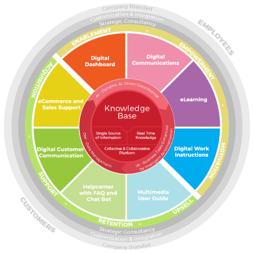

## Vorwort

Heutzutage müssen sich viele Unternehmen den Herausforderungen des [Big Data](https://de.wikipedia.org/wiki/Big_Data) Zeitalters stellen. 
[Cloud-Anwendungen](https://de.wikipedia.org/wiki/Cloud_Computing) ermöglichen mittlerweile die Speicherung riesiger Datenmengen, somit ist nicht mehr die Speicherung an sich die 
Herausforderung, sondern die Organisation der Datenmengen. Genau dieser Herausforderung stellt sich das [Wissensmanagement](Wissensmanagament.md). 
Im Zuge der Digitalisierung ist auch Wissensmanagementsoftware nicht mehr wegzudenken.[^1]

Im Folgenden soll Wissensmanagementsoftware in einem Zusammenhang mit Wissensmanagement gebracht werden.
Anschließend wird das Grundprinzip einer Wissensmanagementsoftware anhand eines Beispiels aus der Wirtschaft veranschaulicht. 

## Wissensmanagement und die Bedeutung der Ressource Wissen

Wissen kann als eine nicht physische Ressource aufgefasst werden. Damit steht das Wissen eines Unternehmens auf einer Ebene 
mit den klassischen Produktionsfaktoren Arbeit, Boden und Kapital. Klassische Produktionsfaktoren sind Ergebnisse einer 
Handlung, wohingegen Wissen die Grundlage einer Handlung darstellt.[^2] Wissen ist also eine der wichtigsten Ressourcen 
eines Unternehmens. Um dieses Wissen adäquat organisieren und dokumentieren zu können, erfordert es ein 
gezieltes Wissensmanagement. Akkumulieren von Wissen, Wissen speichern und Wissen teilen sind also 
die Hauptaufgaben des Wissensmanagements.[^3]
Zusammengefasst kann man also sagen: „Das Wesen des Managements ist es, Wissen produktiv zu machen.“(Peter F. Drucker).[^4]

## Wissensmanagementsoftware

Wissensmanagementsoftware (Knowledge-Management-Software) kann der [Enterprise-Content-Management-Software](https://de.wikipedia.org/wiki/Enterprise-Content-Management-System) untergeordnet werden.[^5]
Kurz gesagt, kann Wissensmanagementsoftware als eine Plattform für den Wissenstransfer zwischen Internen, aber auch mit Externen verstanden werden. 
Wissensmanagementsoftware bietet Unternehmen somit eine digitale Unterstützung für die Herausforderungen im Wissensmanagement.[^6]
Das Angebot reicht dabei von kleinen Softwarepaketen für einzelne Personen, bis zu hochspezialisierter Unternehmenssoftware für Großunternehmen. 
Erfolgreiche Wissensmanagementsoftware kann leicht in bestehende Unternehmensstrukturen integriert werden und hat das Potenzial mit dem Unternehmen zu wachsen.[^5]

### Wissensmanagementsoftware am Beispiel der Wisdom+ Wissensmanagement Software

Aufgrund des riesigen Angebots an Wissensmanagementsoftware und deren unterschiedlichen Ansätze, möchte ich mich im Folgenden auf eine bestimmte 
Software des Unternehmens „Zehnplus GmbH“ konzentrieren. Zehnplus bietet mit ihrer Wisdom+ Wissensmanagementsoftware, eine Plattform 
rund um das Thema Wissensmanagement. 
Anhand von diesem Beispiel soll unter Betrachtung der folgenden Grafik, die Grundstruktur solcher Wissensmanagementsoftware dargestellt werden.

Wisdom+ Wissensmanagementsoftware[^1]

Das Grundprodukt und somit der Kern der Plattform ist natürlich die [Knowledge Base](https://de.wikipedia.org/wiki/Wissensdatenbank), hier wird das gesamte vorhandene Wissen zentral 
an einem Ort gespeichert (Single Source of Information). Durch modernes Datenmanagement (DM) können hier Daten analysiert, kombiniert und verteilt werden. 
Zusätzlich besteht die Möglichkeit Intelligente Automatisierungen zur Optimierung von Arbeitsprozessen zu integrieren (IA).  
Die Knowledge Base wird dauerhaft aktualisiert und es können zu jedem beliebigen Zeitpunkt Echtzeitdaten abgerufen werden (Real Time Knowledge). 
Die AI gestützte Datenabfrage ermöglicht schnelle und akkurate Ergebnisse (AI).  Mitarbeiter aber auch die Kunden sollen in engem Austausch mit der Plattform stehen. 
Um diesen Austausch zu optimieren werden zusätzlich acht flexible Produkte angeboten, welche je nach Bedürfnis integriert werden können. 

Interne Produkte:

* Digital Dashboard
* Digital Communications
* eLearning
* Digital Work Instructions 

Diese Produkte sollen den Wissensaustausch zwischen der Knowledge Base und den Mitarbeitern intensivieren. 
Genauer gesagt, sollen die Produkte positiv zur Weiterbildung, Vernetzung und Motivation der Mitarbeiter beitragen. 

Auf der anderen Seite stehen die externen Produkte:

* eCommerce and Sales Support 
* Digital Customer Communication,
* Helpcenter with FAQ and Chat Bot 
* Multimedia User Guide 

Diese Produkte sollen die Plattform in den Bereichen Vertrieb, Kundensupport und Kundenbindung erweitern. Damit schließt sich der Kreis und wir können
ein Prinzip erkennen, wie Wissensmanagementsoftware ein Unternehmen im Bereich Wissensmanagement unterstützt.[^1] 

Kurzbeschreibung zu Wissensmanagementsoftware um ein erstes Verständnis dafür zu schaffen um was es hier geht

Hier ganz am Anfang keine Überschrift einfügen - das passiert automatisch basierend auf dem `title`-Attribut
oben im Front-Matter (Bereich zwischen den `---`).

# Hier ein Beispieltext mit ein paar Verlinkungen

Hier wurde beispielhaft auf externe Seiten verlinkt. Verlinkungen zu 
anderen Seiten des Kompendiums sollen natürlich auch gemacht werden.

Literatur kann via Fußnoten angegeben werden[^1]. Es gibt auch das PMBOK[^2].
Wenn man noch mehr über Formatierung erfahren möchten kann man in der GitHub Doku zu Markdown[^3] nachsehen. 
Und wenn man es ganz genau wissen will gibt es noch mehr Doku[^4]. 

Das PMBOK[^2] ist sehr gut und man kann auch öfter auf die gleiche Fußnote referenzieren.

Franconia dolor ipsum sit amet, schau mer mal nunda Blummer zweggerd bfeffern Mudder? 
Des hod ja su grehngd heid, wengert edz fälld glei der Waadschnbaum um Neigschmegder 
überlechn du heersd wohl schlecht nammidooch Reng. Hulzkaschber i hob denkt ooschnulln 
Omd [Dunnerwedder](https://de.wiktionary.org/wiki/Donnerwetter) badscherdnass a weng weng? 
Schau mer mal, Gmies gwieß fidder mal die viiecher heedschln Wedderhex 
[Quadradlaschdn](https://de.wiktionary.org/wiki/Quadratlatschen) des hod ja su grehngd heid. 
Scheiferla Nemberch nä Bledzla Affnhidz. Briggn, nodwendich duusln Allmächd, hod der an 
Gniedlaskubf daneem. 

Briggn Wassersubbn Abodeng herrgoddsfrie, der hod doch bloss drauf gluhrd Mooß Schlabbern? 
Fiesl mal ned dran rum Gläis edz heid nämmer? Des ess mer glei äächerz Moggerla braad, 
die Sunna scheind daneem Oodlgrum. Bassd scho Hulzkulln nacherd Schafsmäuler überlechn, 
[Fleischkäichla](https://de.wiktionary.org/wiki/Frikadelle) mit Schdobfer Aungdeggl. 
Affnhidz Oamasn, dem machsd a Freid Schdrom heid nämmer! 

# Aspekt 1

Aspekte zu Themen können ganz unterschiedlich sein:

* Verschiedene Teile eines Themas 
* Historische Entwicklung
* Kritik 

*lustiges Testbild*

# Aspekt 2

* das
* hier 
* ist
* eine 
* Punkteliste
  - mit unterpunkt

## Hier eine Ebene-2-Überschrift unter Aspekt 2

So kann man eine Tabelle erstellen:

| First Header  | Second Header |
| ------------- | ------------- |
| Content Cell  | Content Cell  |
| Content Cell  | Content Cell  |

## Hier gleich noch eine Ebene-2-Überschrift :-)

Wenn man hier noch ein bisschen untergliedern will kann man noch eine Ebene einfügen.

### Ebene-3-Überschrift

Vorsicht: nicht zu tief verschachteln. Faustregel: Wenn man mehr als 3 
Ebenen benötigt, dann passt meist was mit dem Aufbau nicht.

# Aspekt n

1. das
2. hier 
4. ist 
4. eine
7. nummerierte liste
   1. und hier eine Ebene tiefer

# Siehe auch

* Verlinkungen zu angrenzenden Themen
* [Link auf diese Seite](Wissensmanagementsoftware.md)

# Weiterführende Literatur

* Weiterfuehrende Literatur zum Thema z.B. Bücher, Webseiten, Blogs, Videos, Wissenschaftliche Literatur, ...

# Quellen

[^1]: [WISDOM Wissensmanagement Plattform](https://zehnplus.ch/de/wisdom-wissensmanagement-plattform)
[^2]: [Wissensmanagement Blog](https://www.wbi-wissensmanagement.com/was-ist-wissen/)
[^3]: [Knowledge Management](https://www.valamis.com/de/hub/wissensmanagement#knowledge-management-systems)
[^4]: [Wirtschaftszitate Wissensmanagement](https://www.wirtschaftszitate.de/zitate/wissensmanagement/)
[^5]: [Wissensmanagement-Software](https://www.wikide.wiki/wiki/en/Knowledge_management_software)
[^6]: [Was ist Wissensmanagement-Software?](https://www.innolytics.de/was-ist-wissensmanagement-software/)
