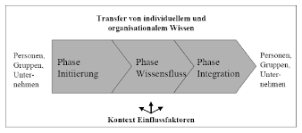

Hier ganz am Anfang keine Überschrift einfügen - das passiert automatisch basierend auf dem `title`-Attribut
oben im Front-Matter (Bereich zwischen den `---`).

# Wissenstransfer

Der Begriff [Wissenstransfer](https://de.wikipedia.org/wiki/Wissenstransfer) wird in verschiedenen Kontexten verwendet. In der Wirtschaft wird darunter 
vor allem der Austausch und 
die Weitergabe von Wissen innerhalb von Unternehmen verstanden, welcher zugleich ein sehr wichtiger Bestandteil des [Wissensmanagements](Wissensmanagement.md) ist.

Kann sowohl der Austausch als auch die Weitergabe des Wissens erfolgreich durchgeführt werden, verschafft dies dem betreffendem Unternehmen Wettbewerbsvorteile.

## Phasen des Wissenstransfers

Unabhängig vom Umfang des vorhandenen Wissens durchläuft der Wissenstransfer immer die Phasen Initiierung, Wissensfluss und Integration. In der Phase der Initiierung 
wird der Wissenstransfer eingeleitet, sprich das Wissen wird identifiziert, dokumentiert und auch bewertet. In der Wissensflussphase findet die tatsächliche Transaktion 
des Wissens statt und in der letzten Phase wird das neu transferierte Wissen erneut überprüft und dann gegebenenfalls integriert.

*Abbildung 1: Phasenmodell nach Krogh und Köhne*

## Wissenstransfer im Projektmanagement

### Klassisches Projektmanagement

Der Ablauf im klassischen [Projektmanagement](Projektmanagement.md) wird mit Hilfe des [Wasserfall-Modells](Wasserfall_Modell.md) dargestellt. Dieses ist ein lineares, nicht iteratives Vorgehensmodell, 
bei dem zunächst die eine Aufgabe komplett abgeschlossen wird bevor neue Aufgaben begonnen werden. Durch eine, am Ende jeder Aufgabe, abschließende Kommunikation mit den 
beteiligten Teams stellt diese Art des Projektmanagements für den Wissenstransfer ein geringeres Risiko an Wissensverlust dar als andere.

### Agiles Projektmanagement

Bezüglich des Ablaufs gibt es beim agilen Projektmanagement einen enormen Unterschied zum klassischen. Dieser ist [iterativ](https://de.wikipedia.org/wiki/Iterativ) 
aufgebaut, das heißt Arbeitsschritte werden öfter durchlaufen, um das bestmögliche Ergebnis für das Projekt zu erlangen. Diese Herangehensweise hat zur Folge, 
dass der Wissenstransfer deutlich komplexer und schwieriger zu managen wird, da zu jeder Zeit ein Rückschritt möglich ist und dies bei unsorgfältiger 
Arbeit zu Verwirrung führt.

## Vorteile eines erfolgreichen Wissenstransfers

Der Austausch und die Weitergabe von Wissen in einem Unternehmen sind unter anderem essenziell für den schnellen und erfolgreichen Abschluss von Projekten und 
erhöhen zudem die Produktivität. Neben den klassischen Team-Meetings, können auch bei spontanen Treffen zweier oder mehrere Mitarbeiter wichtige Informationen 
ausgetauscht werden. 

Ein strukturierter Wissenstransfer sorgt für einen gesunden Wissensfluss im Unternehmen. Dieser erhöht die Innovativität, verkürzt Projektlaufzeiten, 
senkt anfallende Projektkosten, versucht Doppelarbeiten zu vermeiden und führt somit zu einer erhöhten Produktivität im Arbeitsumfeld und generiert 
im selben Zug mehr Mitarbeiterzufriedenheit.  

## Gefahren bei der Wissensweitergabe

Projektorientierte Unternehmen, deren Erscheinungsbild für die Bearbeitung komplexer Aufgaben gut geeignet scheint, birgt dennoch Gefahren, 
gerade hinsichtlich der Wissensweitergabe. 

Die Gründe dafür können auf die typischen Merkmale eines Projekts zurückgeführt werden. (siehe Tabelle 1)

| typisches Merkmal                   | Konsequenz                                                                                                                     | 
| ------------------------------------| -------------------------------------------------------------------------------------------------------------------------------| 
| Zeitliche Begrenztheit              | Nachbearbeitungszeit fehlt, um das erworbene Wissen zu strukturieren und zu dokumentieren.                                     |
| Zuordnung personeller Ressourcen    | Generierte Erfahrung und das erlangte Wissen bleiben nur innerhalb des Projektteams und werden nicht mit Externen kommuniziert.|
| Personelle [Fluktuation](https://de.wikipedia.org/wiki/Fluktuation)| Erlangtes Expertenwissen geht durch die zeitlich begrenzte Tätigkeit verloren.                  |
| Neuartige, komplexe Aufgabenstellung| Übertragbarkeit des erworbenen Wissens auf andere Projekte und Aufgabenstellungen ist ungewiss.                                |

*Tabelle 1: Typische Projektmerkmale erschweren den Wissenstransfer*

## Methoden und Instrumente erschweren den Wissenstransfer

Ausschlaggebend für die Anwendung gewisser Methoden ist die Art des Transfers. Hierbei wird zwischen personifiziertem und kodifizierten 
Wissenstransfer unterschieden. Der Austausch des Wissens findet beim personifizierten Wissenstransfer auf persönlicher Ebene statt. Dies kann auf vielen 
verschiedenen Wegen geschehen:

* [Mitarbeiterworkshops](https://de.wikipedia.org/wiki/Workshop)
* [Interviews](https://de.wikipedia.org/wiki/Interview)
* [Mentoring](https://de.wikipedia.org/wiki/Mentoring)

Von kodifiziertem Wissenstransfer spricht man, wenn der Transfer über Kommunikations- und Informationssysteme abläuft. Heutzutage stellen Datenbanken
in diesem Kontext eine essenzielle Rolle dar.

...

Literatur kann via Fußnoten angegeben werden[^1]. Es gibt auch das PMBOK[^2].
Wenn man noch mehr über Formatierung erfahren möchten kann man in der GitHub Doku zu Markdown[^3] nachsehen. 
Und wenn man es ganz genau wissen will gibt es noch mehr Doku[^4]. 

Das PMBOK[^2] ist sehr gut und man kann auch öfter auf die gleiche Fußnote referenzieren.

Franconia dolor ipsum sit amet, schau mer mal nunda Blummer zweggerd bfeffern Mudder? 
Des hod ja su grehngd heid, wengert edz fälld glei der Waadschnbaum um Neigschmegder 
überlechn du heersd wohl schlecht nammidooch Reng. Hulzkaschber i hob denkt ooschnulln 
Omd [Dunnerwedder](https://de.wiktionary.org/wiki/Donnerwetter) badscherdnass a weng weng? 
Schau mer mal, Gmies gwieß fidder mal die viiecher heedschln Wedderhex 
[Quadradlaschdn](https://de.wiktionary.org/wiki/Quadratlatschen) des hod ja su grehngd heid. 
Scheiferla Nemberch nä Bledzla Affnhidz. Briggn, nodwendich duusln Allmächd, hod der an 
Gniedlaskubf daneem. 

Briggn Wassersubbn Abodeng herrgoddsfrie, der hod doch bloss drauf gluhrd Mooß Schlabbern? 
Fiesl mal ned dran rum Gläis edz heid nämmer? Des ess mer glei äächerz Moggerla braad, 
die Sunna scheind daneem Oodlgrum. Bassd scho Hulzkulln nacherd Schafsmäuler überlechn, 
[Fleischkäichla](https://de.wiktionary.org/wiki/Frikadelle) mit Schdobfer Aungdeggl. 
Affnhidz Oamasn, dem machsd a Freid Schdrom heid nämmer! 

# Siehe auch

* [Projektmanagement](Projektmanagement.md)
* [Wissensmanagement](Wissensmanagement.md)
* [Wasserfall-Modell](Wasserfall_Modell.md)

# Weiterführende Literatur

* Weiterfuehrende Literatur zum Thema z.B. Bücher, Webseiten, Blogs, Videos, Wissenschaftliche Literatur, ...

# Quellen

[^1]: Quellen die ihr im Text verwendet habt z.B. Bücher, Webseiten, Blogs, Videos, Wissenschaftliche Literatur, ... (eine Quelle in eine Zeile, keine Zeilenumbrüche machen)
[^2]: [A Guide to the Project Management Body of Knowledge (PMBOK® Guide)](https://www.pmi.org/pmbok-guide-standards/foundational/PMBOK)
[^3]: [Basic Formatting Syntax for GitHub flavored Markdown](https://docs.github.com/en/github/writing-on-github/getting-started-with-writing-and-formatting-on-github/basic-writing-and-formatting-syntax)
[^4]: [Advanced Formatting Syntax for GitHub flavored Markdown](https://docs.github.com/en/github/writing-on-github/working-with-advanced-formatting/organizing-information-with-tables)

