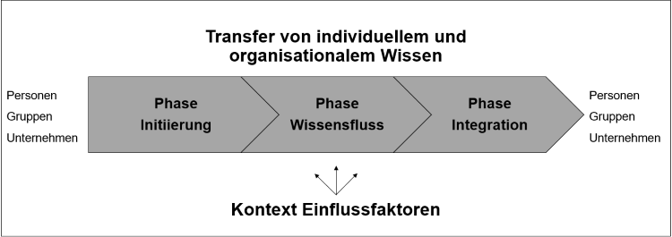

Der Begriff Wissenstransfer wird in verschiedenen Kontexten verwendet. In der Wirtschaft wird darunter 
vor allem der Austausch und die Weitergabe von Wissen innerhalb von Unternehmen verstanden, die zugleich ein sehr wichtiger Bestandteil 
des [Wissensmanagements](Wissensmanagament.md) sind. Kann sowohl der Austausch als auch die Weitergabe des Wissens erfolgreich durchgeführt werden, 
verschafft dies dem betreffendem Unternehmen Wettbewerbsvorteile.[^1][^2]

## Phasen des Wissenstransfers

Unabhängig vom Umfang des vorhandenen Wissens durchläuft der Wissenstransfer immer die Phasen Initiierung, Wissensfluss und Integration[^3]. In der Phase der Initiierung 
wird der Wissenstransfer eingeleitet, sprich das Wissen wird identifiziert, dokumentiert und auch bewertet. In der Wissensflussphase findet die tatsächliche Transaktion 
des Wissens statt und in der letzten Phase wird das transferierte Wissen erneut geprüft und dann gegebenenfalls integriert.[^4][^5]

*Abbildung 1: Phasenmodell nach Krogh und Köhne* [^5]

## Wissenstransfer im Projektmanagement

### Klassisches Projektmanagement

Der Ablauf im klassischen [Projektmanagement](Projektmanagement.md) wird mit Hilfe des [Wasserfall-Modells](Wasserfall_Modell.md) dargestellt. Dies ist ein lineares, nicht 
[iteratives](https://de.wikipedia.org/wiki/Iterativ)  Vorgehensmodell, bei dem zunächst die eine Aufgabe komplett abgeschlossen wird bevor neue Aufgaben begonnen werden.[^6] Durch eine, am Ende jeder Aufgabe, 
abschließende Kommunikation mit den beteiligten Teams stellt diese Art des Projektmanagements für den Wissenstransfer ein geringeres Risiko an 
Wissensverlust als andere Vorgehensweisen dar.[^7]

### Agiles Projektmanagement

Bezüglich des Ablaufs gibt es beim agilen Projektmanagement einen enormen Unterschied. Dieser ist iterativ
aufgebaut, das heißt Arbeitsschritte werden öfter durchlaufen, um das bestmögliche Ergebnis für das Projekt zu erlangen. Diese Herangehensweise hat zur Folge, 
dass der Wissenstransfer deutlich komplexer und schwieriger zu managen ist, da jederzeit ein Rückschritt möglich ist und dies bei unsorgfältiger 
Kommunikation zu Verwirrung führt.[^8]

## Vorteile eines erfolgreichen Wissenstransfers

Der Austausch und die Weitergabe von Wissen in einem Unternehmen sind essenziell für den schnellen und erfolgreichen Abschluss von Projekten. Neben den 
klassischen Team-Meetings, können auch bei spontanen Treffen zweier oder mehrere Mitarbeiter wichtige Informationen 
ausgetauscht werden.[^9] 

Ein strukturierter Wissenstransfer sorgt für einen gesunden Wissensfluss im Unternehmen. Dieser erhöht die Innovativität, verkürzt Projektlaufzeiten, 
senkt anfallende Projektkosten, versucht Doppelarbeiten zu vermeiden, führt somit zu einer erhöhten Produktivität im Arbeitsumfeld und generiert 
im selben Zug eine höhere Mitarbeiterzufriedenheit.[^10]  

## Gefahren bei der Wissensweitergabe

Projektorientierte Unternehmen, deren Erscheinungsbild für die Bearbeitung komplexer Aufgaben gut geeignet scheint, birgt dennoch Gefahren
hinsichtlich der Wissensweitergabe. 

Die Gründe dafür können auf die typischen Merkmale eines Projekts zurückgeführt werden.[^11] *(siehe Tabelle 1)*

| typisches Merkmal                   | Konsequenz                                                                                                                     | 
| ------------------------------------| -------------------------------------------------------------------------------------------------------------------------------| 
| Zeitliche Begrenztheit              | Um das erworbene Wissen zu strukturieren und zu dokumentieren fehlt die Nachbearbeitungszeit.                                  |
| Zuordnung personeller Ressourcen    | Generierte Erfahrung und das erlangte Wissen bleiben nur innerhalb des Projektteams und werden nicht mit Externen kommuniziert.|
| Personelle [Fluktuation](https://de.wikipedia.org/wiki/Fluktuation)| Durch die zeitlich begrenzte Tätigkeit im Projekt geht Expertenwissen verloren.                |
| Neuartige, komplexe Aufgabenstellung| Übertragbarkeit des erworbenen Wissens auf andere Projekte und Aufgabenstellungen ist ungewiss.                                |

*Tabelle 1: Typische Projektmerkmale erschweren den Wissenstransfer* [^11][^12]

## Methoden und Instrumente für den Wissenstransfer

Ausschlaggebend für die Anwendung gewisser Methoden ist die Art des Transfers. Hierbei wird zwischen personifiziertem und kodifizierten 
Wissenstransfer unterschieden. Der Austausch des Wissens findet beim personifizierten Wissenstransfer auf persönlicher Ebene statt. Dabei gibt es für Unternehmen 
viele Möglichkeiten den Wissenstransfer anzustoßen:[^13]

* [Mitarbeiterworkshops](https://de.wikipedia.org/wiki/Workshop)
* [Interviews](https://de.wikipedia.org/wiki/Interview)
* [Mentoring](https://de.wikipedia.org/wiki/Mentoring)

Von kodifiziertem Wissenstransfer spricht man, wenn der Transfer über Kommunikations- und Informationssysteme abläuft, wobei Datenbanken in diesem Kontext eine
essenzielle Rolle einnehmen. So ist es heutzutage verbreitet, im Rahmen von Projekten genauso Interviews und spontane Gespräche mit Kollegen zu nutzen, wie auch auf
das Wissen von Datenbanken zurückzugreifen.[^14][^15]

# Siehe auch

* [Projektmanagement](Projektmanagement.md)
* [Wasserfall-Modell](Wasserfall_Modell.md)
* [Wissenslandkarte](Wissenslandkarte.md)
* [Wissensmanagement](Wissensmanagament.md)
* [Wissensmarkt](Wissensmarkt.md)
* [Wissensspirale](Wissensspirale.md)

# Weiterführende Literatur

* Georg von Krogh, Marija Köhne: *Der Wissenstransfer in Unternehmen: Phasen des Wissenstransfers und wichtige Einflussfaktoren. In: Die Unternehmung.*
* Kirsten A. Schröder: *Mitarbeiterorientierte Gestaltung des unternehmensinternen Wissenstransfers: Einflussfaktoren auf den teaminternen Wissenstransfer.*

# Quellen

[^1]: [Wissenstransfer - Weiterentwicklung durch den Austausch von Wissen](https://www.sage.com/de-de/blog/lexikon/wissenstransfer/)
[^2]: [Wissenstransfer - einfach erklärt, YouTube](https://www.youtube.com/watch?v=wlNf-T9LqV0)
[^3]: [Der Wissenstransfer in Unternehmen: Phasen des Wissenstransfers und wichtige Einflussfaktoren. In: Die Unternehmung. Heft 5, 1998, S. 235–252.](https://www.jstor.org/stable/pdf/24183239.pdf?refreqid=excelsior%3A77fd38f51da5a53c7a9dc15276f819f1)
[^4]: [Phasen Wissenstransfer](https://de.wikipedia.org/wiki/Wissenstransfer)
[^5]: [Phasenmodell nach Krogh und Köhne](https://www.jstor.org/stable/pdf/24183239.pdf?refreqid=excelsior%3A77fd38f51da5a53c7a9dc15276f819f1)
[^6]: [Wasserfall-Modell](https://de.wikipedia.org/wiki/Wasserfallmodell)
[^7]: [Klassisches und agiles Projektmanagement im Vergleich](https://dl.gi.de/bitstream/handle/20.500.12116/3061/47.pdf?sequence=1&isAllowed=y)
[^8]: [Wie funktioniert agiles Projektmanagement?](https://www.cobra.de/wie-funktioniert-agiles-projektmanagement/?utm_source=google&utm_medium=cpc&utm_campaign=crm_software_testversion&pk_campaign=crm_software_testversion&msclkid=faba32df3ce5149e407c53526e2c943f)
[^9]: [Vorteile eines erfolgreichen Wissenstransfers](https://www.sage.com/de-de/blog/lexikon/wissenstransfer/)
[^10]: [Wissenstransfer im Projektmanagement - Sinn und Unsinn von Anreizsystemen](https://www.projektmagazin.de/artikel/wissenstransfer-im-projektmanagement-sinn-und-unsinn-von-anreizsystemen_6939)
[^11]: [Wissensweitergabe als Ziel](https://www.projektmagazin.de/artikel/wissenstransfer-im-projektmanagement-sinn-und-unsinn-von-anreizsystemen_6939)
[^12]: [Mitarbeiterorientierte Gestaltung des unternehmensinternen Wissenstransfers: Einflussfaktoren auf den teaminternen Wissenstransfer. Springer-Verlag, 2013, S. 57ff.](https://link.springer.com/chapter/10.1007/978-3-322-81576-7_3)
[^13]: [Personifizierter und kodifizierter Transfer/Methoden und Instrumente für den Wissenstransfer](https://www.sage.com/de-de/blog/lexikon/wissenstransfer/)
[^14]: [Betriebsinterner Wissenstransfer: Die 8 wichtigsten Maßnahmen](https://www.lecturio.de/magazin/wissenstransfer/#:~:text=Wissenstransfer%20%C3%BCber%20Mitarbeiter%201%20Altersgemischte%20Teams.%20Altersgemischte%20Teams,4%20Moderierte%20%C3%9Cbergabegespr%C3%A4che.%20...%205%20Lessons%20Learned.%20)
[^15]: [Methoden zum Wissenstransfer: Reden ist Silber, Schweigen der Tod](https://www.lecturio.de/magazin/methoden-zum-wissenstransfer/)
