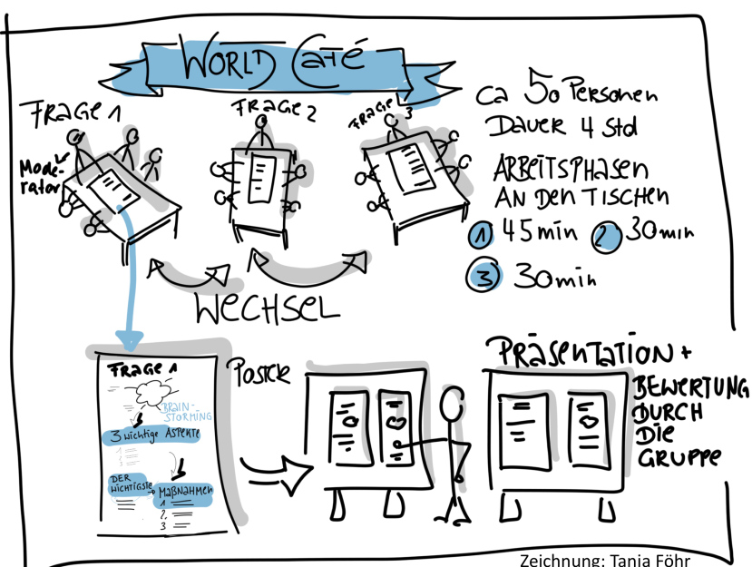

Das World Café ist eine interaktive Alternative zu Konferenzen und Seminaren und bietet eine zwanglose Atmosphäre, die Teilnehmer zu Diskussionen, welche alltäglichen Gesprächen in einem Café ähneln sollen, anregt.[^1] Dabei soll der Austausch von Gedanken und Ideen dazu führen, dass neue Sichtweisen entstehen und Probleme aus vielen verschiedenen Perspektiven betrachtet werden können.[^2]

# Eignung 

Das World-Café eignet sich besonders für größere Gruppen, wobei die Teilnehmerzahl zwischen ca. 12 und 2000 Teilnehmern stark variieren kann.[^3]

Die Methode kann dabei helfen, unterschiedliche Ideen und Meinungen zu komplexen Themen zu sammeln, um die verschiedenen Sichtweisen zu verdeutlichen. So können neben offensichtlichen Lösungsansätzen auch unkonventionelle Lösungen und Vorgehensweisen erörtert werden.[^1]

# Vorteile
Ein ideen- und facettenreicher Austausch zu anregenden Fragestellungen hat unter anderem folgende Vorteile:
* das Wissen Vieler wird vernetzt
* kreatives und innovatives Denken wird gefördert
* Interdisziplinärer Erfahrungstausch
* Lösungen werden gemeinsam erarbeitet
* das Team- und Zusammengehörigkeitsgefühl wird gestärkt
* neue oder bestehende Beziehungen und Netzwerke werden aufgebaut oder vertieft[^4]

# Planung

Bei der Planung müssen folgende Fragen geklärt werden:
* Welchen Nutzen hat das World Café ?
* Was ist das Kernthema ?
* Welche Fragen sollen diskutiert werden ?
* Wer sind die Teilnehmer ?
* Wie sollen die Teilnehmer in verschiedene Gruppen aufgeteilt werden ? 
* Wer übernimmt die Moderation ?
* Wie kann man eine zwangslose Atmosphäre schaffen, die informelle und kreative Gespräche hervorbringt[^5]

Zudem werden folgende Hilfsmittel benötigt:
1. Ein Raum, groß genug für mehrere Gruppentische (dieser kann nach Belieben gestaltet werden, doch je mehr die Atmosphäre einem Café ähnelt, desto besser) 
2. Gruppentische mit 4-6 Stühlen
3. Papiertischdecken
4. Stifte[^6]

# Ablauf

Die Moderation begrüßt die Teilnehmer zum World Café und erklärt ihnen den genauen Ablauf. Themen und Fragestellungen werden präsentiert, wobei es sich um eine, aber auch um mehrere Fragen, die aufeinander aufbauen, handeln kann.[^7] 

Danach wird die Etikette vorgestellt.
Von allen Teilnehmern wird erwartet, dass sie stets höflich zueinander sind, sich gegenseitig zuhören und aussprechen lassen. Es ist wichtig, dass jeder seine eigenen Ansichten vorträgt und auch auf andere eingeht, um unterschiedliche Sichtweisen zu diskutieren, aufeinander aufzubauen oder auch um mehrere Ideen zu verbinden.[^7]

Pro Tisch gibt es einen Gastgeber und vier bis fünf Teilnehmer, die sich ca. 20-30 Minuten mit einer Frage beschäftigen, bevor alle, außer der Gastgeber, den Tisch wechseln und eine neue Diskussion starten. Hierbei werden die Gruppen nach jeder Runde durchgemischt, sodass es nicht bei derselben Gruppenkonstellation bleibt. Zu Beginn einer neuen Diskussionsrunde werden die bereits gesammelten Ideen aus der vorherigen Runde kurz zusammengefasst. Während jeder Runde ist es ausdrücklich erwünscht, dass die Teilnehmer während ihren Diskussionen beispielsweise Stichpunkte, Tabellen oder Skizzen auf der Tischdeckecke niederschreiben, wobei deren Kreativität keine Grenzen gesetzt sind.[^7]

Zum Abschluss werden alle gesammelten Ideen und Ergebnisse der einzelnen Tische kurz im Plenum zusammengefasst, wobei eine visuelle Hilfe, wie etwa das Aufhängen der Papiertischdecken, hilfreich sein kann. Diese endgültige Zusammenfassung hilft dabei, Muster aus den Diskussionen zu erkennen und Lösungsmöglichkeiten zu skizzieren.[^7]

Die zuvor genannte Vorgehensweise ist flexibel anpassbar und Komponenten, wie etwa Dauer oder Teilnehmerzahl können nach Bedarf verändert werden. Das Wichtigste am World Café sind Kontakt und Austausch unter den Teilnehmern.[^7]

# Siehe auch

Weitere kreative Methoden
* [6-3-5_Methode](6_3_5_Methode.md)
* [Walt-Disney-Methode](Walt_Disney_Methode.md)
* [Zukunftswerkstatt](Zukunftswerkstatt.md)
* [Ideen-Marathon](Ideen_Marathon.md)
* [Kopfstandtechnik](Kopfstandtechnik.md)

# Weiterführende Literatur

* [World-Café](https://de.wikipedia.org/wiki/World-Café)
* [Den Austausch und Diskussionen mit einem World Café anregen](https://www.youtube.com/watch?v=ekCPJlcYZ0Y)
* [World Café (Weltcafé) Methode](https://www.europa-union.de/fileadmin/files_eud/PDF-Dateien_EUD/Best_Practice/Rezepte_WorldCafé.pdf)
* [Die World-Café-Methode: Kooperativ zum Erfolg](https://www.youtube.com/watch?v=N-SgDI4N8E8)

# Quellen

[^1]: [World Café – Moderation von Großgruppenveranstaltungen](https://organisationsberatung.net/world-cafe-grossgruppen-methode/)
[^2]: [MEIN DEIN UNSER WIRKEN](https://www.worldcafe.eu/de/)
[^3]: [World-Café: Die Pause als Methode](https://www.futur2.org/article/world-cafe-die-pause-als-methode/)
[^4]: [World-Café - Gespräche, die zählen](https://www.agonda.de/World-Cafe/world-cafe.html)
[^5]: [Methodeneinsatz - World Café](https://www.kas.de/de/web/politische-bildung/world-cafe)
[^6]: [World-Café](https://www.methodenkartei.uni-oldenburg.de/uni_methode/world-cafe/)
[^7]: [World Café: Gruppendiskussionen mit Café-Atmosphäre](https://wb-web.de/material/methoden/world-cafe-gruppendiskussionen-mit-cafe-atmosphare.html)
