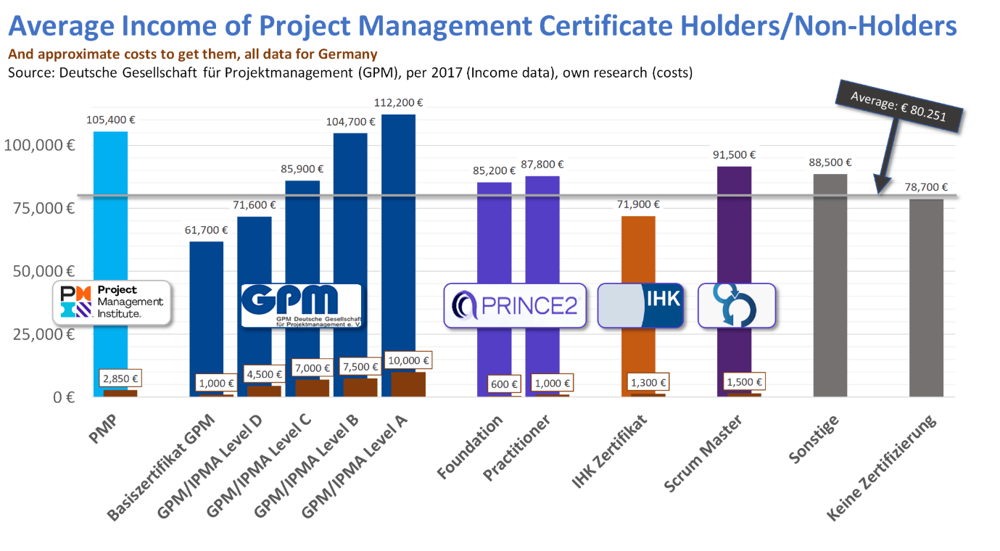

# 1. Zertifizierungen und deren Bedeutung im Projektmanagement 

Bereits in den vorherigen Artikeln wurde deutlich betont, dass es nicht nur eine gültige Definition von Projektmanagement (PM) gibt und es neben der klassischen und agilen Variante zu Abweichungen in der praktischen Umsetzung kommen kann. 
Um nun eine allgemeingültige Aussage über die Fähigkeiten einer Person in der Umsetzung des PM treffen zu können, ist es notwendig, die Fähigkeiten von unabhängigen und breitflächig akzeptierten Instanzen zertifizieren zu lassen. Dies geschieht über Zertifizierungsstellen wie z.B. der [DEKRA](https://www.dekra-akademie.de), dem [TÜV](https://akademie.tuv.com/catalogsearch/result/?q=Projektmanager) oder der [Deutschen Gesellschaft zur Zertifizierung von Managementsystemen (DQS)](https://www.dqs.de/de/), die neben dem Lehrangebot für die Zertifizierung auch eine Prüfung zur Zertifikatsausstellung anbieten.[^1]

# 2. Vergleich der Zertifizierung im PM

Abhängig davon, welche Kompetenzen oder Themen für einen Projektmanager besonders relevant sind und wie weit dieser bereits qualifiziert ist, bieten sich Zertifizierungen für unterschiedliche PM-Standards an. Diese Projektmanagementstandards werden oft in unterschiedlicher Modifikation von einer Organisation angeboten. Die folgende Tabelle gibt einen ersten Überblick über vier der beliebtesten Zertifizierungen in den unterschiedlichen Projektmanagementstandards.

## Übersicht etablierter PM-Standards[^1][^2][^3] 

| PM-Organisation / Anbieter                   | IPMA                     | PMI                                | PMI                                | Prince2            | Scrum.org      |
|-----------------------------------------|--------------------------|------------------------------------|------------------------------------|--------------------|----------------|
| Beliebte Zertifizierung als Beispiel | IPMA Level D             | PMI-ACP-Zerifizierung              | PMP-Zertifikat                     | Prince2 Foundation | PSM1           |
| Einordnung klassisches / agiles PM   | Klassisch                | Agil                               | Klassisch                          | Agil               | Agil           |
| Schwerpunkt                             | Hard- und Softskills     | Methodiken wie Scrum, Kanban, etc. | Prozesse und Methoden              | Prince-2 Methodik  | Scrum Methodik |
| Zielgruppe                              | Mittlere Erfahrung im PM | Projektmanager mit Berufserfahrung | Projektmanager mit Berufserfahrung | Anfänger           | Anfänger       |
| Gültigkeit                              | 5 Jahre                  | 2 Jahre                            | 3 Jahre                            | 3 Jahre            | Lebenslang     |
| Kosten                                  | Ca. 4.000 Euro           | Ca. 400 Euro                       | Ca. 3.000 Euro                     | Bis zu 1500 Euro   | Ca. 1.500 Euro; Prüfung: 150 Euro       |

Ziel dieser Tabelle ist es, einen ersten Überblick über PM-Zertifizierungen zu geben und deren Unterschiede aufzuzeigen. Einzelne Organisationen und deren angebotenen Zertifizierungen, wie die [IPMA](IPMA_Institution.md), das [PMI](PMI_Institution.md) oder [Scrum.org](SCRUM_org_Institution.md) werden in den seperaten Arikeln näher beleuchtet.

# 3. Auswahl der passenden Zertifizierung

Neben den offensichtlichen Auswahlkriterien, wie das zur Verfügung stehende Budget, dem aktuellen Wissensstand oder die Gültigkeitsdauer des Zertifikats (vgl. 2. Vergleich der Zertifizierung im PM), spielen auch Aspekte, wie der bereits etablierte PM-Standards des Arbeitgebers bzw. des Unternehmens eine Rolle. Erhofft sich ein Arbeitnehmer die Anerkennung des Zertifikats bei internationalen Arbeitgebern, so bietet sich ein Zertifikat der [IPMA-Organisation](https://www.gpm-ipma.de/ueber_uns/ipma.html) an, welche in 60 Ländern vertreten ist; diese bietet neben der Vermittlung von Softskills auch eine Einflussnahme von Projektarbeiten in die PM Zertifizierung an, was je nach Lerntyp von Bedeutung sein kann. Für Arbeitgeber im asiatischen Raum hat hingegen das [PMP-Zertifikat](https://www.pmi-gc.de/das-chapter/pmi) oder die [PMI-ACP-Zertifizierung](https://www.pmi.org/certifications/agile-acp) der PMI eine höhere Chance, anerkannt zu werden. 

# 4. Praktische Relevanz von Zertifizierungen im PM

Bereits zu Beginn dieses Artikels (vgl. 1. Zertifizierungen und deren Bedeutung im Projektmanagment) wurde aufgezeit, dass PM-Zertifizierungen eine objektive Darlegung des Wissenstands und der Fähigkeiten von Projektmangern verkörpern. Darüber hinaus gibt es weitere Beweggründe, eine PM-Zertifizierung zu erwerden. Diese werden im Folgenden kurz dargestellt.

## 4.1. Erhöhung der Glaubwürdigkeit

Projektmanager mit einer PM-Zertifizierung erhöhen nachweislich ihre Glaubwürdigkeit von Kunden und Lieferanten, da sie zusätzlich Möglichkeit hatten, ihre Fachexpertise zu steigern.

## 4.2. Höhere Chancen auf dem Arbeitsmarkt

Mit der Aufnahme einer PM-Zertifizierung in den Lebenslauf, steigt nicht nur nicht die Einstellwahrscheinlichkeit, sondern auch die Gehaltaussichten in Anhägigkeit von der Branche und der Unternehmensgröße. Nicht zu vernachlässigen ist, dass Projektmanager mit 6 bis 10 Jahren Berufserfahrung im Durschnitt bereits über 87.000 Euro Brutto-Jahresgehalt erzielen und monetär weniger Anreize zur Weiterbildung haben. Demnach stärkt eine Zertifizierung ungemein die Reputation des Projektmanagers.

Die [folgende Grafik](https://www.theprojectgroup.com/blog/projektmanagement-zertifizierung/) verdeutlicht den Gehaltsvorsprung, den zertifizierte Projektmanager im Durchschnitt erzielen. 

Die Abbildung zeigt, dass nicht jede erlangte Zertifizierung Verdienstmöglichkeiten über dem Durchschnittsgehalt von 80.251 Euro Brutto-Jahresgehalt im PM garantiert. Dennoch ist der Erwartungwert des Mehrverdienstes mit 1.551 Euro (Durschnitts Brutto-Jahresgehalt mit Zertifizierung - Durschnitts Brutto-Jahresgehalt ohne Zertifizierung = 80.251 Euro - 78.700 Euro = 1.551 Euro) positiv und oft bereits deutlich höher als die Kosten der Zertifizierung. Setzt man die Mehrverdienstmöglichkeiten für Projektmanager mit einer Zertifizierung im Verhältnis zu den Zertifizierungskosten, so ist der Return on Investment mit einer   [Prince2 Foundation-](https://www.prince2.com/de) und einer [PMP-Zertifizierung](https://www.pmi-gc.de/das-chapter/pmi) am höchsten. Diese Tatsache berücksichtigt jedoch nicht die zuvor (vgl. 3. Auswahl der passenden Zertifizierung) Faktoren wie Kenntnisstand, Anforderungen des Arbeitgebers, oder individuell unterschiedliche Faktoren wie der Vorbereitungsdauer.

# Fazit

Insgesamt gibt es eine Vielzahl an Zertifizierungen im PM. Dies ermöglicht Projektmanagern eine Zertifizierung anhand der persönlichen Bedürfnissen auszuwählen. Auch wenn eine Zertifizierung nicht immer zu einer überdurchschnittliche Bezahlung führt, wurde eine Vielzahl an Vorteilen aufgezeigt, wie beispielsweise die Erhöhung der Glaubwürdigkeit oder schlichtweg eine objektive Darlegung der eigenen Fähigkeiten, was wiederum berufliche Eintrittsbarrieren mindern kann.

# Abkürzungsverzeichnis

# Siehe auch

* Verlinkungen zu angrenzenden Themen
* [Link auf diese Seite](Zertifizierungen.md)

# Weiterführende Literatur

* Weiterfuehrende Literatur zum Thema z.B. Bücher, Webseiten, Blogs, Videos, Wissenschaftliche Literatur, ...

# Quellen

[^1]: [Projekte und Projektmanagement](https://link-1springer-1com-1v0gnf2jn006b.han.ub.fau.de/content/pdf/10.1007%2F978-3-658-30085-2.pdf)
[^2]: [Zertifizierungen](https://www.peterjohann-consulting.de/zertifizierungen/#1_zertifizierungen_im_projektmanagement)
[^3]: [Basic Formatting Syntax for GitHub flavored Markdown](https://docs.github.com/en/github/writing-on-github/getting-started-with-writing-and-formatting-on-github/basic-writing-and-formatting-syntax)
[^4]: [Advanced Formatting Syntax for GitHub flavored Markdown](https://docs.github.com/en/github/writing-on-github/working-with-advanced-formatting/organizing-information-with-tables)
