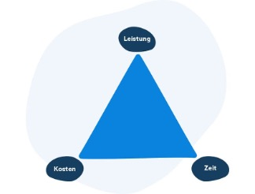

# 1.	Allgemeines zur Projektplanung im klassischen Projektmanagement:

 Grundlage für dierPlanung ist die Vorgabe der Projektleitung und die Bildung eines Teams, damit die Personen, die später am Projekt arbeiten, bereits in die Planung einbezogen werden. Ausgehend von der Grobplanung geht man später immer mehr ins Detail. Hierbei wird dann ein detaillierter Plan erstellt, welches in Teilprojekte aufgeteilt wird. Der Projektleiter und das Team stimmen dann Kosten und Ressourcen auf Basis der detaillierten Planung genauer ab. Die Projektleiter und das Team müssen auch abklären, ob die getroffenen Annahmen realistisch sind. 
 Grundlage für die Planung ist die Vorgabe der Projektleitung und die Bildung eines Teams, damit die Personen, die später am Projekt arbeiten, bereits in die Planung einbezogen werden. Ausgehend von der Grobplanung geht man später immer mehr ins Detail. Hierbei wird dann ein detaillierter Plan erstellt, welches in Teilprojekte aufgeteilt wird. Der Projektleiter und das Team stimmen dann Kosten und Ressourcen auf Basis der detaillierten Planung genauer ab. Die Projektleiter und das Team müssen auch abklären, ob die getroffenen Annahmen realistisch sind. 
 Es wird außerdem ein Projektmanagementplan erstellt, um die Übersichtlichkeit zu bewahren. Der Projektmanagementplan legt zusätzlich genau fest, welche Verantwortungsbereiche von welchen Mitarbeitern abgedeckt werden.

# 2.	Schritte die in der Projektplanung durchlaufen werden:

Wie bereits oben erwähnt, gibt es die Grobplanung und die Detailplanung. Die ersten drei Schritte bilden die Grobplanung. Dagegen ergibt sich die Detailplanung aus der Prozess-, Termin- und Kostenplanung.

**1.	Phasenplanung:** Festlegung der Phasen                     
**2.	Projektstrukturplanung:** Gliederung der Projektinhalte in kleinere Teilprojekte                                       
**3.	Planung der Projektorganisation:** Verteilung der Rollen und Verantwortlichkeiten                               
**4.	Ablauf- und Terminplanung:** Erstellung einer chronologischen Rheinfolge der Arbeitspakete           
**5.	Ressourcenplanung:** Ermittlung der notwendigen Ressourcen    
**6.	Kostenplanung:** Bildung der Projektkosten (Ressourcen + Dauer)

# 3.	Projektplanung in der Praxis:

Oftmals stellt sich die Frage „Kann man mit seinem Team nicht einfach rauslaufen und schauen wie es läuft? “. Dies kann funktionieren ist jedoch sehr unwahrscheinlich, da man mit hoher Wahrscheinlichkeit einige Dinge vergessen wird. Es kann aber durchaus auch dazu kommen, dass die notwendigen Ressourcen oder finanzielle Mittel vor Abschluss des Projekts ausgeschöpft werden.
In der Praxis kann aber eine Anfrage zur „Entwicklung eines Projektplans ganz andere Erwartungen haben, da der Begriff „Projektplanung“ als Sammelbegriff interpretiert werden kann. Deshalb stellen die 7W-Fragen einen guten Leitfaden zum Entwickeln eines Projektplans. Es ist aber von essentieller Bedeutung, die Projektplanung genau auf die festgelegten Ziele abzustimmen.

# 4.	Ziele im klassischen Projektmanagement:

Im klassischen Projektmanagement geht es darum, möglichst klare Ziele zu haben, die in der gewünschten Zeit und zu den gewünschten Kosten erreicht werden können. Deshalb spricht man oftmals in diesem Zusammenhang vom „magischen Dreieck“. Die Aufgabe des Projektmanagers bezieht sich auf das Finden eines goldenen Mittelwegs. Dies bedeutet, dass die drei Faktoren „Kosten, Zeit und Leistung“ stets im Gleichgewicht sein müssen. Je kürzer die Zeit, desto höher die Kosten. Je umfangreicher die Dienste, desto länger die Zeit usw. Eine konstante Balance zu halten, die Kunde und Projektteam vertragen, ist eine verantwortungsvolle und schwierige Aufgabe, die eine gute Kommunikation voraussetzt. Allgemein kann man sagen, dass die Hauptziele des Projektmanagements Organisation, Planung, Steuerung und Leitung sind.

# 5.	Zieldefinierung mit der SMART Regel:

Ziele sind stets ein Motivationsfaktor. Deshalb kann es durchaus kontraproduktiv sein, sich unangemessene Ziele zu setzen, bei denen vom vornhinein klar ist, dass das Erreichen dieser Ziele sehr schwer sein wird. Um Ziele sinnvoll zu definieren gibt es die deshalb sogenannte SMART-Regel.
-	**Spezifisch**
-	**Messbar**
-	**Akzeptiert**
-	**Realistisch**
-	**Terminierbar**.  

Dies bedeutet, dass das Ziel so deutlich wie möglich gesetzt werden sollen, um später nicht darüber diskutieren zu müssen, ob das Ziel erreicht wurde oder nicht.

# Inhaltsverzeichnis

* [Allgemeines zu Projektplanung im klassischen Projektmanagement](#allgemeines-zu-projektplanung-im-klassischen-projektmanagement)
* [Schritte die in der Projektplanung durchlaufen werden](Schritte-die-in-der-Projektplanung-durchlaufen-werden)
* [Projektplanung in der Praxis](Projektplanung-in-der-Praxis)
* [Ziele im klassischen Projektmanagement](Ziele-im-klassischen-Projektmanagement)
* [Zieldefinierung mit der SMART Regel](Zieldefinierung-mit-der-SMART-Regel)

