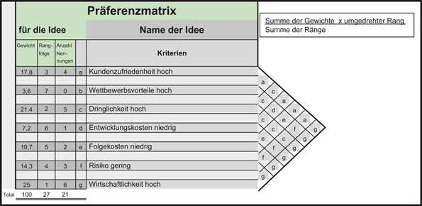

# Überblick über das Thema - kurze Begriffsklärung 
Bevor tiefer in das Thema eingestiegen wird, werden zuerst die Begriffe "Zielbeziehungen“ und "klassisches Projektmanagement“ kurz erklärt. 

## Zielbeziehungen

Unter Zielbeziehungen wir die Beziehung zwischen den einzelnen Ziele (meist Unternehmensziele) beschrieben. Dabei kann man drei bzw. vier verschiedene Arten von Beziehungen unterscheiden: 

* **Komplementäre Ziele:** Dies ist die Idealbeziehung zwischen den einzelnen Zielen. Durch das Erreichen eines Ziels wird zugleich ein anderes Ziel erreicht (Synergieeffekt) 
* **Konkurrierende Ziele:** Hier lassen sich die Ziele nicht gegenseitig verfolgen, sondern entfernen sich eher voneinander.
* **Neutrale Ziele:** Diese Ziele werden voneinander unabhängig/neutral erreicht. In der heutigen Welt der Digitalisierung sind solche Ziele aber kaum noch auffindbar.
* **Autonome Ziele:** Man kann nicht gleichzeitig mehrere Ziele erreichen [^1]

## Klassisches Projektmanagement 

Projektmanagement allgemein beinhaltet die Anwendung von Wissen, Fähigkeiten und Techniken für Management- und Führungstätigkeiten [^2]
Beim klassischen Ansatz geht es eher darum, dass man Methoden und Erzeugnisse des Projektmanagement zu standardisierten Projektabläufen zusammenfasst (=Projektmanagementsysteme[^8]). Die Projektphasen sind also strikt durchgeplant und es herrscht somit eine hohe Planungssicherheit. [^3] [^4]
Neben dem klassischen Projektmanagement gibt es auch noch das [agile Projektmanagement](Umgang_mit_Kritik.md) 

Im nächsten Schritt wird der Zusammenhang zwischen Zielbeziehungen im klassischen Projektmanagement erklärt. 

# Zielbeziehungen im Klassischen Projektmanagement

Bevor ein Projekt gestartet wird, müssen immer gewisse Ziele vereinbart werden, die zu erreichen sind. Dementsprechend sollten Ziele klar und deutlich formuliert werden. Hierfür gibt es  die  [„SMART“ Regel](SMART_Ziele.md) „Specific Measurable Accepted Realistic Timely“ [^5]
Die Zielbeziehung steht vor allem dann im Vordergrund, wenn es darum geht einzelne Ziele möglichst schnell und zugleich qualitativ hochwertig zu erreichen. Bedeutet je anspruchsvoller das Ziel/Ergebnis ist, beispielsweise hinsichtlich der Qualität oder Funktion, umso höher sind die damit verbundenen Kosten, Leistungen und Zeitlicher Bedarf. Dahingegend müssen wichtige Abstimmungen gemacht werden. Zum besseren Verständnis nachfolgend einige Beispiele: 

|Das zu erreichende priorisierte Ziel  |Damit verbunden Leistungen  |
| :-------------:                        |               :-------------: |
|Leistungsumfang/ziel erhöhen          |Kosten und Projektdauer steigen |
|Kostenziel hat Priorität (Kosten sinken) |Leistungs- & Zeitziel steigt 
|Terminziel hat Priorität               |Kosten steigen & Leistungen einsparen

Der Projektmanager muss sich also hier im Klaren werden, was er wie und unter welche Priorität erreichen will. Stets zu beachten ist, dass die Anforderungen des Kundens an erster Stelle stehen. [^5]

Die am häufigsten vorkommende Form der Zielbeziehungen im Projektmanagement sind die konkurrierenden Zielbeziehungen. Der Grund hierfür ist, dass in einem Projekt nicht nur ein Ziel sondern mehrere Ziele nebeneinander aufgeführt werden. Typische Beispiele von konkurrierenden Zielen sind[^9]:

* **Termineinhaltung vs. Budgeteinhaltung**
* **Termineinhaltung vs. Leistungserstellung (Qualität und/oder Quantität)**
* **Budgeteinhaltung vs. Leistungserstellung (Qualität und/oder Quantität)** 

## Zielbeziehungsmatrix/Präferenzmatrix

Um Ziele in einem Projekt besser zu veranschaulichen eignet sich auch eine sogenannte Zielbeziehungsmatrix oder auch Präferenzmatrix. Beide Matrizes helfen bestimmte Kriterien, Anforderungen etc. in einem Projekt zu priorisieren und diese auch zu vergleichen. Sie kommen vor allem in der BWL, Controlling, Projektmanagement und Qualitätsmanagement zum Einsatz. Diese Matrizes werden anhand folgender Schritte aufgebaut:

1. Kriterien sammeln – Brainstromen
2. Matrix erstellen
3. Paarweiser Vergleich
4. Auswertung und Konsquenzen
5. Rangfolge erstellen [^6]

Nachfolgend ein Beispiel einer Präferenzmatrix[^7]:

 

# Siehe auch:
* [Projektmanagement](Projektmanagement.md)
* [Agiles Projektmanagement](https://www.projektmagazin.de/glossarterm/agiles-projektmanagement) 
*	[Präferenzmatrix](https://de.wikipedia.org/wiki/Pr%C3%A4ferenzmatrix#:~:text=Die%20Pr%C3%A4ferenzmatrix%20ist%20ein%20einfaches,das%20jeweils%20wichtigere%20Kriterium%20vermerkt.&text=Das%20Kriterium%20mit%20den%20meisten%20Nennungen%20ist%20das%20wichtigste%20Kriterium)
* [Zielbeziehungsmatrix](https://de.wikipedia.org/wiki/Zielbeziehungsmatrix)

# Weiterführende Literatur 

* Video: [Welche Gefahren lauern in Projektzielen? - Zielbeziehungen und ihre Bedeutung](https://www.youtube.com/watch?v=3rx5u1GmX1o)

# Quellen

[^1]: [Zielbeziehungen](https://marjorie-wiki.de/wiki/Zielbeziehungen/)
[^2]: [A Guide to the Project Management Body of Knowledge (PMBOK® Guide) p. 112](https://www.pmi.org/pmbok-guide-standards/foundational/PMBOK)
[^3]: [Standardisierung vs. Kultur:Klassisches vs. Agiles Projektmanagement](https://dl.gi.de/bitstream/handle/20.500.12116/3061/47.pdf?sequence=1&isAllowed=y) 
[^4]: [Klassisches Projektmanagement](https://www.agile-heroes.de/magazine/was-ist-klassisches-projektmanagement/)
[^5]: [Projektmanagement:lernen, lehren und für die Praxis](https://de.scribd.com/book/348063388/Projektmanagement-lernen-lehren-und-fur-die-Praxis)
[^6]: [Präferenzmatrix](https://de.wikipedia.org/wiki/Pr%C3%A4ferenzmatrix) 
[^7]: [Innovation 2.0 pp 257-323|  Die Werkzeuge, Manfred Noe ](https://link.springer.com/book/10.1007/978-3-658-02583-0) 
[^8]: [Projektmanagementsysteme](https://www.capterra.com.de/sem/compare/directory/30002/project-management/software?account_campaign_id=11412926622&account_adgroup_id=111801304956&target=projektmanagement%20system&ad_id=542893678485&matchtype=b&gclsrc=aw.ds&&utm_source=ps-google&gclid=EAIaIQobChMInqOVjMqp9AIVA893Ch0V3QyJEAAYAiAAEgJ01_D_BwE)
[^9]: [Projektanforderungen und Projektziele](https://www.researchgate.net/profile/Michael-Gessler-2/publication/325659457_Projektanforderungen_und_Projektziele/links/5b1bbe89aca272021cf44c86/Projektanforderungen-und-Projektziele.pdf)
